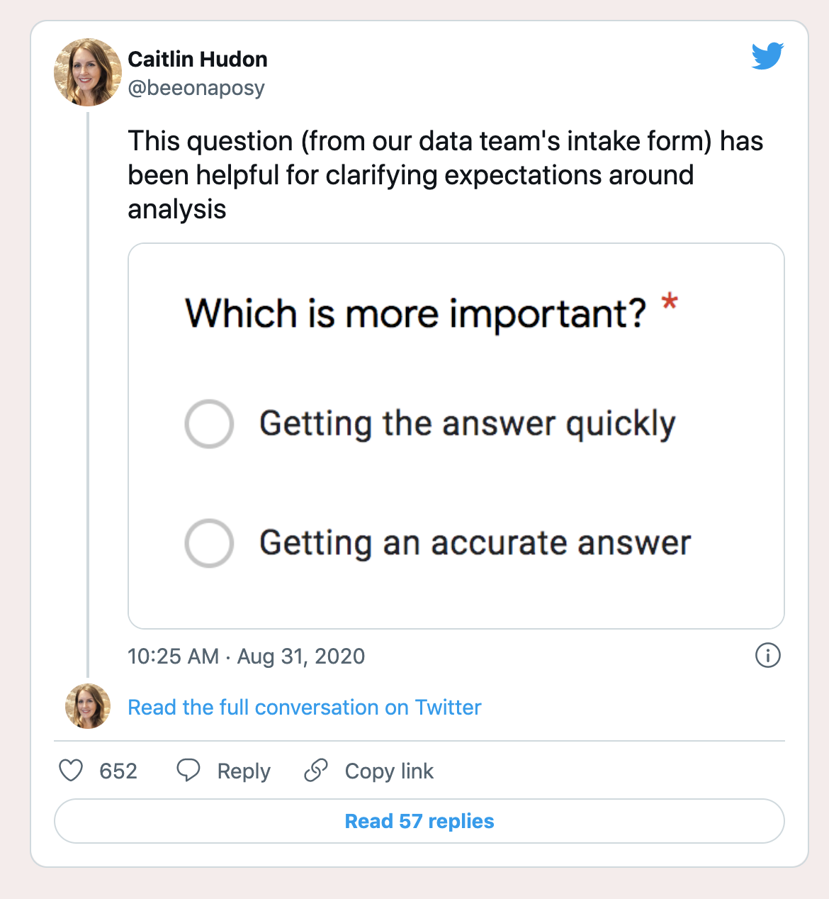
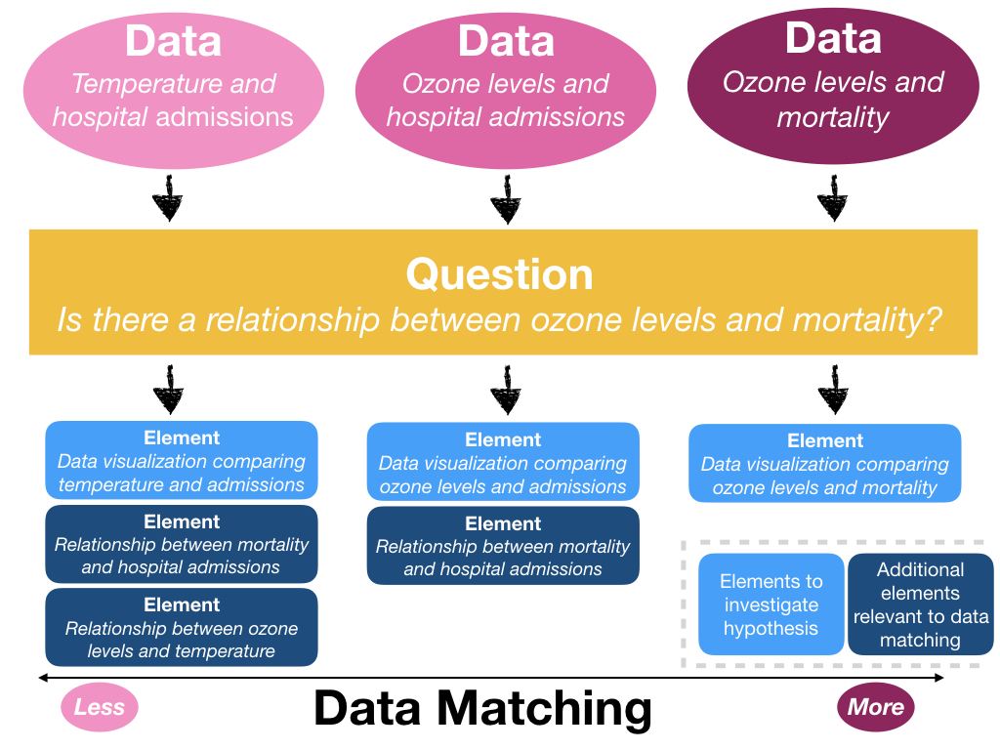
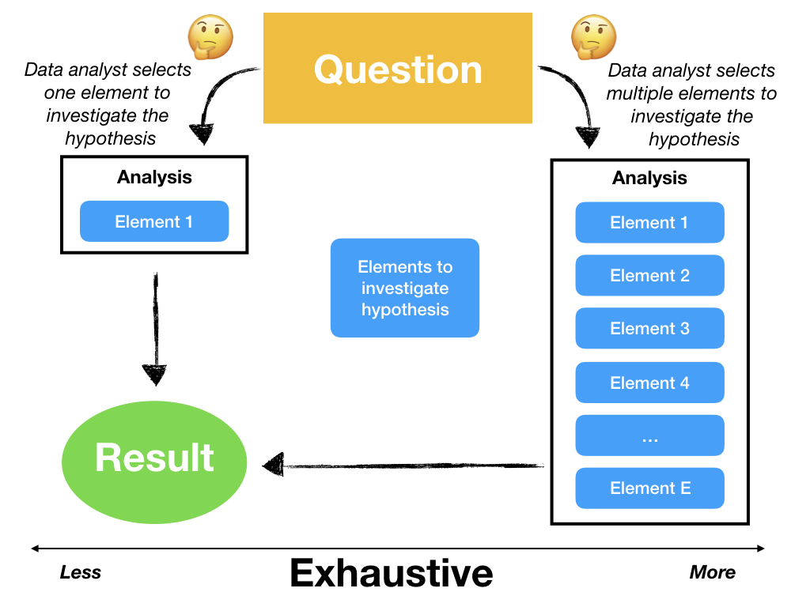
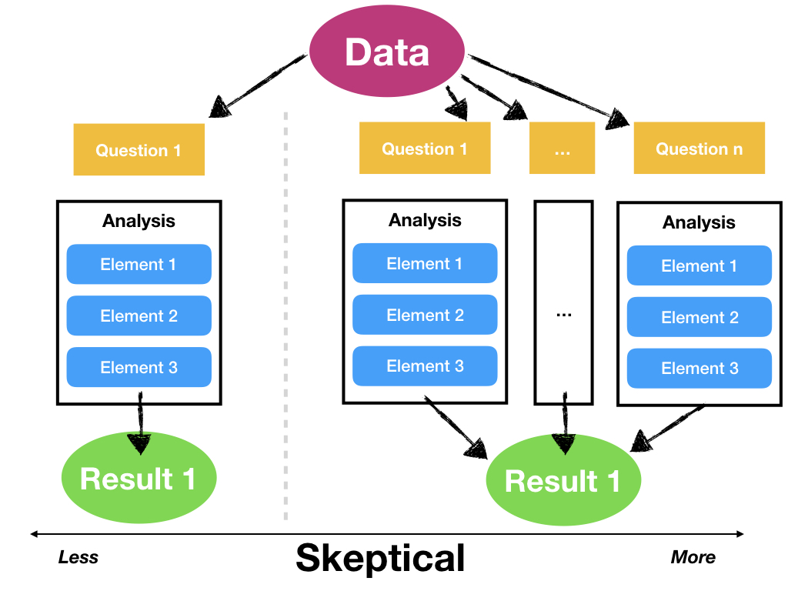
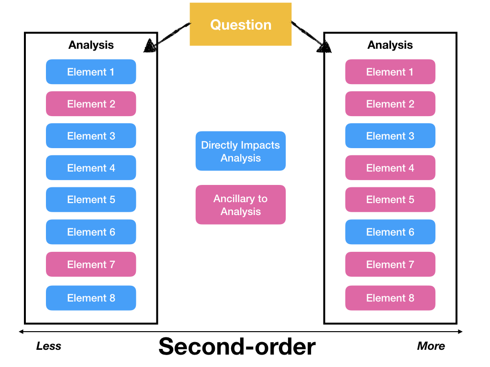
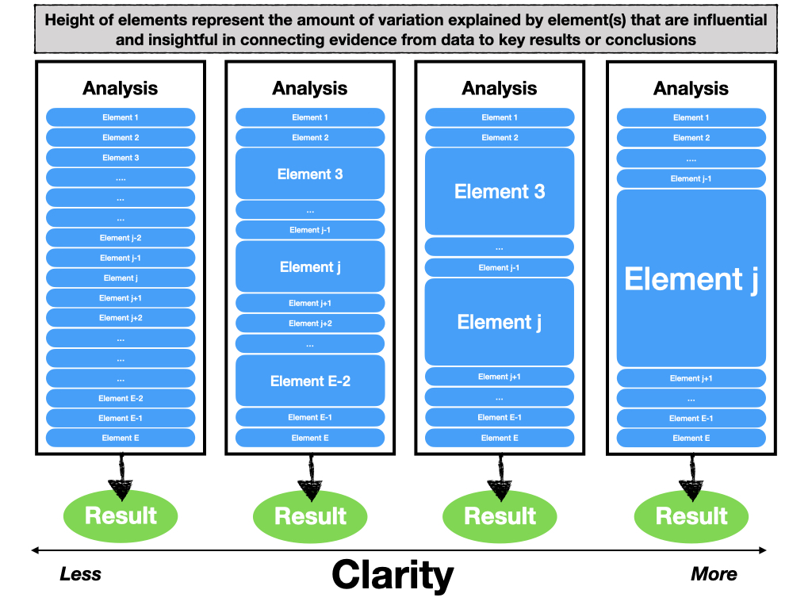
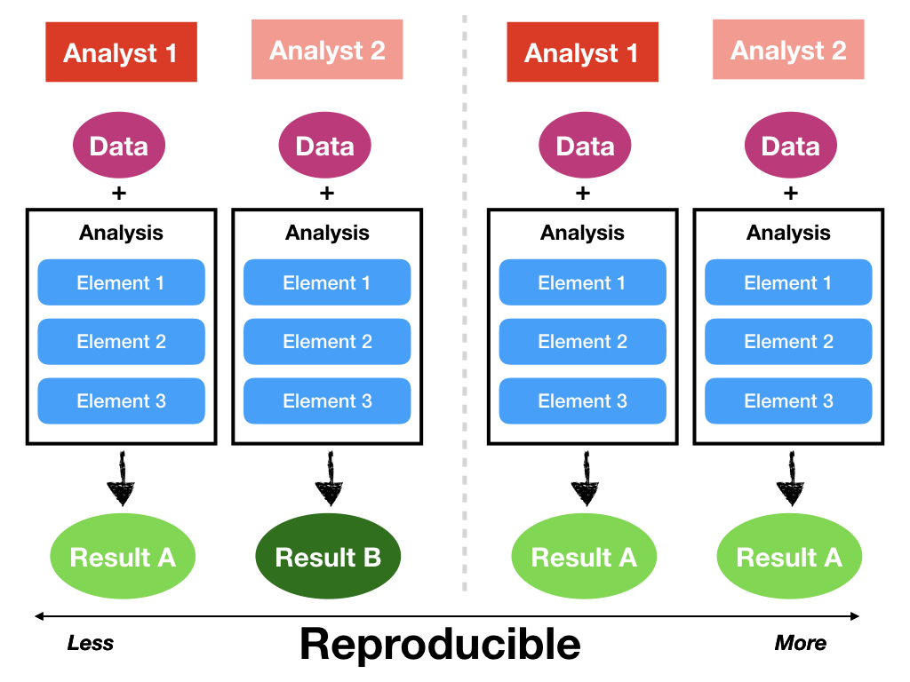
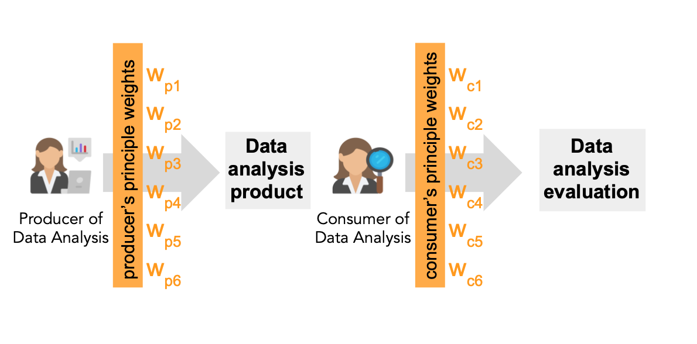

```{r setup, include=FALSE}
knitr::opts_chunk$set(warning = FALSE, message = FALSE, 
                      fig.retina = 3, fig.align = "center")
```

```{r packages-data, include=FALSE}
library(tidyverse)
library(ggdag)
```

```{r xaringanExtra, echo=FALSE}
xaringanExtra::use_xaringan_extra(c("tile_view"))
```

class: center middle main-title section-title-1

# Design Principles

.class-info[

**Session 1**

.light[BEM 392: Math Business Capstone<br>
Lucy D'Agostino McGowan
]

]

---

class: title-inv-1


# `r emo::ji("wave")` Lucy D'Agostino McGowan

[mcgowald@wfu.edu](mailto:mcgowald@wfu.edu) <br>

[lucymcgowan.com](https://lucymcgowan.com)

---

class: title title-1

# Follow Along
<br><br>
.center[
# [bit.ly/bem-392-s22-slides-1](https://bit.ly/bem-392-s22-slides-1)
]
---

class: title-inv-1 middle

# What are the goals of your analysis?

--

.box-1.medium[problem statement]
---

class: title title-1

# Design thinking

.box-inv-1.medium[User-focused (Who is your audience?)]

--

.box-inv-1.medium[Empathize!]

--

.box-inv-1.medium[Collaborative]

--

.box-inv-1.medium[Iterative]

---


class: title title-1

# Design Principles of Data Analysis

.pull-left[
.box-inv-1.medium[Statistical thinking]
]

--

.pull-right[
.box-inv-1.medium[Design thinking]
]

---

class: title title-1

# Design Principles of Data Analysis

.pull-left[
.box-inv-1.medium[Statistical thinking]

.box-1[What methods should we use?]

.box-1[What computational tools should we use?]

.box-1[What workflow should we use?]


]

.pull-right[
.box-inv-1.medium[Design thinking]
]

---

class: title title-1

# Design Principles of Data Analysis

.pull-left[
.box-inv-1.medium[Statistical thinking]

.box-1[What methods should we use?]

.box-1[What computational tools should we use?]

.box-1[What workflow should we use?]


]

.pull-right[
.box-inv-1.medium[Design thinking]

.box-1[What methods should I use?]

.box-1[How should this information be presented?]

.box-1[How reproducible should this analysis be?]
]

---

class: title title-1

# Design Principles of Data Analysis

.center[

<figure>
</img>
</figure>

]
.footer[
Caitlin Hudon [An Intake Form for Data Requests](https://www.caitlinhudon.com/posts/2020/09/16/data-intake-form)
]

---

class: title title-1

# Design Principles of Data Analysis

--

.box-inv-1.medium[Why?]

--

.box-1[provides a formal mechanism to describe a data analysis]

--

.box-1[provides a language for *alignment* between data analysis *producers* and *consumers*]
---

class: title title-1

# Design Principles of Data Analysis

.box-inv-1[Prioritized qualities that are relevant to the analysis and can be observed or measured]

--

.box-inv-1[A data analyst can use these principles to guide the choice of what to use to build a data analysis]

--

.box-inv-1[A data analysis can be scored based on how well it adheres to each of these principles]

---

class: title title-1, center

# `r fontawesome::fa("laptop")` Application Exercise
<br><br>

.huge[[bit.ly/bem-392-s22-ae3](https://bit.ly/bem-392-s22-ae3)]

---

class: title title-1

# Design Principles of Data Analysis

.box-inv-1[Data Matching]

--

.box-inv-1[Exhaustive]

--

.box-inv-1[Skeptical]

--

.box-inv-1[Second Order]

--

.box-inv-1[Clarity]

--

.box-inv-1[Reproducible]

---

class: title title-1

# Design Principles of Data Analysis

.box-inv-1[Data Matching]

.box-2[Exhaustive]

.box-2[Skeptical]

.box-2[Second Order]

.box-2[Clarity]

.box-2[Reproducible]

---


class: title title-1

# Data Matching

.box-inv-1[Data available directly matches the data needed to investigate a question]

--

.box-1[As opposed to trying to answer a questions with *surrogate* variables, for example]

---

class: center

<figure>
 </img>
</figure>

---


class: title title-1

# Data Matching Scenario

.box-inv-1[Your client communicates that data matching is important, but their available data does not match the question well]

--

.box-1.medium[Find more / different data]

--

.box-1.medium[Reframe the question]
---

class: title title-1, center

# `r fontawesome::fa("laptop")` Application Exercise
<br><br>

.huge[[bit.ly/bem-392-s22-ae3](https://bit.ly/bem-392-s22-ae3)]

---

class: title title-1

# Design Principles of Data Analysis

.box-2[Data Matching]

.box-inv-1[Exhaustive]

.box-2[Skeptical]

.box-2[Second Order]

.box-2[Clarity]

.box-2[Reproducible]

---

class: title title-1

# Exhaustive

<br>

.box-inv-1[use multiple, complementary tools or methods to address the same question, knowing that each given tool reveals some aspects of the data but obscures other aspects]

---

class: center

<figure>
 </img>
</figure>
---

class: title title-1, center

# `r fontawesome::fa("laptop")` Application Exercise
<br><br>

.huge[[bit.ly/bem-392-s22-ae3](https://bit.ly/bem-392-s22-ae3)]

---


class: title title-1

# Design Principles of Data Analysis

.box-2[Data Matching]

.box-2[Exhaustive]

.box-inv-1[Skeptical]

.box-2[Second Order]

.box-2[Clarity]

.box-2[Reproducible]

---

class: title title-1

# Skeptical

<br>

.box-inv-1[An analysis is *skeptical* if multiple, related questions are considered using the same data ]

---

class: center

<figure>
 </img>
</figure>

---


class: title title-1

# Skeptical

.box-inv-1[The need for more or less skepticism in a data analysis is typically governed by outside circumstances and the context in which the analysis sits]

--

.box-inv-1[Analyses that may have large impacts or result in significant monetary costs will typically be subject to detailed scrutiny]

---

class: title title-1

# Skeptical Example

- In July 2000, the Health Effects Institute (HEI) published a reanalysis of the Harvard Six Cities Study

--

- This is a seminal air pollution study that showed significant associations between air pollution and mortality

--

- Due to the potential regulatory impact of the study, HEI commissioned an independent set of investigators to reproduce the findings and conduct a series of sensitivity analyses

--

- The result was a nearly 300 page volume where the data and findings were subject to intense skepticism and every alternative hypothesis was examined

---

class: title title-1

# (Not) Skeptical Example 

- There are other instances when skepticism in the form of alternate explanations is not warranted in the analysis.

--

- A large clinical trial studying the effect of a pest management intervention on asthma outcomes, the reported analysis is ultimately a simple comparison of asthma symptoms in two groups

--

-  Such an analysis is acceptable here due to the strict pre-specification of the analysis and due to the standards and practices that the community has developed regarding the reporting of clinical trials
---

class: title title-1, center

# `r fontawesome::fa("laptop")` Application Exercise
<br><br>

.huge[[bit.ly/bem-392-s22-ae3](https://bit.ly/bem-392-s22-ae3)]

---

class: title title-1

# Design Principles of Data Analysis

.box-2[Data Matching]

.box-2[Exhaustive]

.box-2[Skeptical]

.box-inv-1[Second Order]

.box-2[Clarity]

.box-2[Reproducible]

---

class: center

<figure>
 </img>
</figure>

---

class: title title-1

# Second Order

<br>

.box-inv-1[An analysis is *second-order* if it includes methods, tooling or workflows that do not directly address the primary question, but give important context or supporting information to the analysis]


---

class: title title-1

# Second Order Example

- In presenting an analysis of data collected from a new type of machine, one may include details of who manufactured the machine, why it was built, or how it operates

--

- Often, in studies where data are collected in the field, such as in people’s homes, field workers can relay important details about the circumstances under which the data were collected
---

class: title title-1, center

# `r fontawesome::fa("laptop")` Application Exercise
<br><br>

.huge[[bit.ly/bem-392-s22-ae3](https://bit.ly/bem-392-s22-ae3)]

---

class: title title-1

# Design Principles of Data Analysis

.box-2[Data Matching]

.box-2[Exhaustive]

.box-2[Skeptical]

.box-2[Second Order]

.box-inv-1[Clarity]

.box-2[Reproducible]

---

class: title title-1

# Clarity

<br>

.box-inv-1[Analyses with *clarity* summarize or visualize data in a way that is influential in explaining how the underlying data phenomena or data-generation process connects to any key output, results, or conclusions]

---


class: center

<figure>
 </img>
</figure>
---

class: title title-1, center

# `r fontawesome::fa("laptop")` Application Exercise
<br><br>

.huge[[bit.ly/bem-392-s22-ae3](https://bit.ly/bem-392-s22-ae3)]

---


class: title title-1

# Design Principles of Data Analysis

.box-2[Data Matching]

.box-2[Exhaustive]

.box-2[Skeptical]

.box-2[Second Order]

.box-2[Clarity]

.box-inv-1[Reproducible]

---

class: title title-1

# Reproducible

<br>

.box-inv-1[An analysis is *reproducible* if someone who is not the original producer can take the published code and data and compute the same results as the original producer]

---

class: center

<figure>
 </img>
</figure>
---

class: title title-1, center

# `r fontawesome::fa("laptop")` Application Exercise
<br><br>

.huge[[bit.ly/bem-392-s22-ae3](https://bit.ly/bem-392-s22-ae3)]

---

class: title-1 title center

# Alignment

<figure>
 </img>
</figure>

---

class: title title-1, center

# `r fontawesome::fa("laptop")` Application Exercise
<br><br>

.huge[[bit.ly/bem-392-s22-ae1](https://bit.ly/bem-392-s22-ae1)]

---

class: title title-1, center

# `r fontawesome::fa("laptop")` Application Exercise
<br><br>

.huge[[bit.ly/bem-392-s22-ae2](https://bit.ly/bem-392-s22-ae2)]

---

class: title-inv-1 middle center

# Part 3: Discuss with client and re-submit scores by end of February


