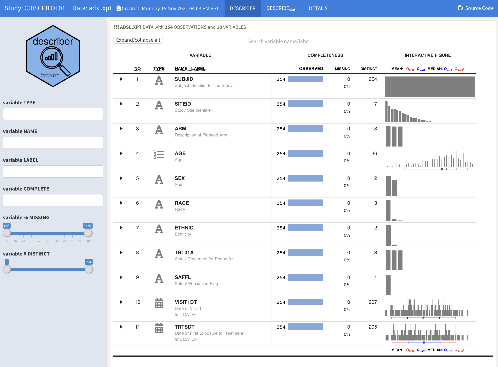

```{r setup, include=FALSE}
knitr::opts_chunk$set(warning = FALSE, message = FALSE, 
                      fig.retina = 3, fig.align = "center")
```

```{r packages-data, include=FALSE}
library(tidyverse)
library(ggdag)
```

```{r xaringanExtra, echo=FALSE}
xaringanExtra::use_xaringan_extra(c("tile_view"))
```

class: center middle main-title section-title-1

# Data Organization Principles

.class-info[

**Session 2**

.light[BEM 392: Math Business Capstone<br>
Lucy D'Agostino McGowan
]

]

---

class: title title-1

# Follow Along
<br><br>
.center[
# [bit.ly/bem-392-s22-slides-2](https://bit.ly/bem-392-s22-slides-2)
]
---

class: center middle section-title section-title-1

# Why have a system?

---

class: center, middle section-title section-title-1


# "Your closest collaborator is you six months ago, but you don't reply to emails."
.small[— *paraphrase thanks to [Paul Wilson](https://twitter.com/gonuke), [Karen Cranston](https://twitter.com/kcranstn), and [Mark Holder](https://twitter.com/mtholder)*]

---

class: center middle section-title section-title-1

# biggest takeaway: Have a system

---

class: title title-1 center 

# File organization

.middle-main[

]
---


class: title title-1 center 

# File organization

.middle-main[


]
---


class: title title-1 center

# File organization

.middle-main[

]

---
class: title title-1

# File organization

.footer[Jenny Bryan ["Naming Things"](https://speakerdeck.com/jennybc/how-to-name-files)]

.pull-left[
.box-2[

# Jenny Bryan
]
]

---

class: title title-1

# File organization

.footer[Jenny Bryan ["Naming Things"](https://speakerdeck.com/jennybc/how-to-name-files)]

.pull-left[
.box-2[

# Jenny Bryan
]
]
--
.pull-right[
.box-1[machine readable]

]

---
class: title title-1

# File organization

.footer[Jenny Bryan ["Naming Things"](https://speakerdeck.com/jennybc/how-to-name-files)]

.pull-left[
.box-2[

# Jenny Bryan
]
]

.pull-right[
.box-1[machine readable]

.box-1[human readable]

]

---

class: title title-1

# File organization

.footer[Jenny Bryan ["Naming Things"](https://speakerdeck.com/jennybc/how-to-name-files)]

.pull-left[
.box-2[

# Jenny Bryan
]
]

.pull-right[
.box-1[machine readable]

.box-1[human readable]

.box-1[plays well with default ordering]

]

---
class: title title-1

# File organization

.footer[Jenny Bryan ["Naming Things"](https://speakerdeck.com/jennybc/how-to-name-files)]

.pull-left[
.box-2[

# Jenny Bryan
]
]

.pull-right[
.box-1[machine readable]

.box-1[human readable]

.box-1[plays well with default ordering]

.box-inv-1.medium[have a system!]
]


---


class: title title-1

# File organization


.box-inv-1.medium[Do something sensible]

--

.box-1[Take advantage of your machine's ability to sort]

--

.box-1[Start with numbers // dates [yyyy-mm-dd]]

--

.box-1[Make it easy for a human to interpret]

--

.box-inv-1.medium[Have a system!]


---
class: title title-1 center

# File organization

.middle-main[

]

---


---

class: title title-1

# Data organization in spreadsheets  
.footer[Karl Browman & Kara Woo (2017) Data Organization in Spreadsheets https://doi.org/10.1080/00031305.2017.1375989]


---


class: title title-1

# Data organization in spreadsheets  

.pull-left[

# Kara Woo
]

.pull-right[


# Karl Broman
]

---


class: title title-1

# Data organization in spreadsheets

.center[
</img>
]
.box-inv-1.medium[My second favorite Kara-Karl collaboration]

.footer[Karl Browman & Kara Woo (2017) Data Organization in Spreadsheets https://doi.org/10.1080/00031305.2017.1375989]

---

class: center middle

</img>
---


class: title title-1

# Data organization in spreadsheets
.footer[Karl Browman & Kara Woo (2017) Data Organization in Spreadsheets https://doi.org/10.1080/00031305.2017.1375989]

.pull-left[

.box-inv-1[Be Consistent]

]

---

class: title title-1

# Data organization in spreadsheets
.footer[Karl Browman & Kara Woo (2017) Data Organization in Spreadsheets https://doi.org/10.1080/00031305.2017.1375989]

.pull-left[

.box-1[Be Consistent]

.box-inv-1[Choose Good Names]

]

---

class: title title-1

# Choose Good Names

good name	| good alternative|	avoid
----------|-----------------|-------
Max_temp_C|	MaxTemp	|Maximum Temp (°C)
Precipitation_mm|	Precipitation	|precmm
Mean_year_growth|	MeanYearGrowth|	Mean growth/year
sex	|sex|	M/F
weight	|weight	|w.
cell_type	|CellType	|Cell type
Observation_01	|first_observation	|1st Obs.


.footer[Table 1 from Karl Browman & Kara Woo (2017) Data Organization in Spreadsheets https://doi.org/10.1080/00031305.2017.1375989]

---

class: title title-1

# Data organization in spreadsheets
.footer[Karl Browman & Kara Woo (2017) Data Organization in Spreadsheets https://doi.org/10.1080/00031305.2017.1375989]

.pull-left[

.box-1[Be Consistent]

.box-1[Choose Good Names]

.box-inv-1[Write Dates as YYYY-MM-DD]

]


---

.center[

]
.footer[From: https://xkcd.com/1179/]

---

class: title title-1

# Data organization in spreadsheets
.footer[Karl Browman & Kara Woo (2017) Data Organization in Spreadsheets https://doi.org/10.1080/00031305.2017.1375989]

.pull-left[
.box-1[Be Consistent]

.box-1[Choose Good Names]

.box-1[Write Dates as YYYY-MM-DD]

.box-inv-1[No Empty Cells]


]
---

class: title title-1

# No Empty Cells

</img>
.footer[Figure 2 from Karl Browman & Kara Woo (2017) Data Organization in Spreadsheets https://doi.org/10.1080/00031305.2017.1375989]

---


class: title title-1

# No Empty Cells

</img>
.footer[Figure 3 from Karl Browman & Kara Woo (2017) Data Organization in Spreadsheets https://doi.org/10.1080/00031305.2017.1375989]


---

class: title title-1

# Data organization in spreadsheets
.footer[Karl Browman & Kara Woo (2017) Data Organization in Spreadsheets https://doi.org/10.1080/00031305.2017.1375989]

.pull-left[
.box-1[Be Consistent]

.box-1[Choose Good Names]

.box-1[Write Dates as YYYY-MM-DD]

.box-1[No Empty Cells]

.box-inv-1[Put Just One Thing in a Cell]


]


---


class: title title-1

# Data organization in spreadsheets
.footer[Karl Browman & Kara Woo (2017) Data Organization in Spreadsheets https://doi.org/10.1080/00031305.2017.1375989]

.pull-left[
.box-1[Be Consistent]

.box-1[Choose Good Names]

.box-1[Write Dates as YYYY-MM-DD]

.box-1[No Empty Cells]

.box-1[Put Just One Thing in a Cell]

.box-inv-1[Make it a Rectangle]


]


---
class: title title-1

# Make it a rectangle

</img>
.footer[Figure 5 from Karl Browman & Kara Woo (2017) Data Organization in Spreadsheets https://doi.org/10.1080/00031305.2017.1375989]


---

class: title title-1

# Data organization in spreadsheets
.footer[Karl Browman & Kara Woo (2017) Data Organization in Spreadsheets https://doi.org/10.1080/00031305.2017.1375989]

.pull-left[
.box-1[Be Consistent]

.box-1[Choose Good Names]

.box-1[Write Dates as YYYY-MM-DD]

.box-1[No Empty Cells]

.box-1[Put Just One Thing in a Cell]

.box-1[Make it a Rectangle]


]

.pull-right[
.box-inv-1[Create a Data Dictionary]

]
---

class: title title-1

# Data organization in spreadsheets
.footer[Karl Browman & Kara Woo (2017) Data Organization in Spreadsheets https://doi.org/10.1080/00031305.2017.1375989]

.pull-left[
.box-1[Be Consistent]

.box-1[Choose Good Names]

.box-1[Write Dates as YYYY-MM-DD]

.box-1[No Empty Cells]

.box-1[Put Just One Thing in a Cell]

.box-1[Make it a Rectangle]


]

.pull-right[
.box-1[Create a Data Dictionary]

.box-inv-1[No Calculations in Raw Data]

]
---


class: title title-1

# Data organization in spreadsheets
.footer[Karl Browman & Kara Woo (2017) Data Organization in Spreadsheets https://doi.org/10.1080/00031305.2017.1375989]

.pull-left[
.box-1[Be Consistent]

.box-1[Choose Good Names]

.box-1[Write Dates as YYYY-MM-DD]

.box-1[No Empty Cells]

.box-1[Put Just One Thing in a Cell]

.box-1[Make it a Rectangle]


]

.pull-right[
.box-1[Create a Data Dictionary]

.box-1[No Calculations in Raw Data]

.box-inv-1[No 'Colors' as Data]

]


---
class: title title-1

# No 'Colors' as Data


</img>
.footer[Figure 10 from Karl Browman & Kara Woo (2017) Data Organization in Spreadsheets https://doi.org/10.1080/00031305.2017.1375989]


---

class: title title-1

# Data organization in spreadsheets
.footer[Karl Browman & Kara Woo (2017) Data Organization in Spreadsheets https://doi.org/10.1080/00031305.2017.1375989]

.pull-left[
.box-1[Be Consistent]

.box-1[Choose Good Names]

.box-1[Write Dates as YYYY-MM-DD]

.box-1[No Empty Cells]

.box-1[Put Just One Thing in a Cell]

.box-1[Make it a Rectangle]


]

.pull-right[
.box-1[Create a Data Dictionary]

.box-1[No Calculations in Raw Data]

.box-1[No 'Colors' as Data]

.box-inv-1[Make Backups]

]
---
class: title title-1

# Data organization in spreadsheets
.footer[Karl Browman & Kara Woo (2017) Data Organization in Spreadsheets https://doi.org/10.1080/00031305.2017.1375989]

.pull-left[
.box-1[Be Consistent]

.box-1[Choose Good Names]

.box-1[Write Dates as YYYY-MM-DD]

.box-1[No Empty Cells]

.box-1[Put Just One Thing in a Cell]

.box-1[Make it a Rectangle]


]

.pull-right[
.box-1[Create a Data Dictionary]

.box-1[No Calculations in Raw Data]

.box-1[No 'Colors' as Data]

.box-1[Make Backups]

.box-inv-1[Use Data Validation]


]

---


class: title title-1

# Data organization in spreadsheets

.footer[Karl Browman & Kara Woo (2017) Data Organization in Spreadsheets https://doi.org/10.1080/00031305.2017.1375989]

.pull-left[
.box-1[Be Consistent]

.box-1[Choose Good Names]

.box-1[Write Dates as YYYY-MM-DD]

.box-1[No Empty Cells]

.box-1[Put Just One Thing in a Cell]

.box-1[Make it a Rectangle]


]

.pull-right[
.box-1[Create a Data Dictionary]

.box-1[No Calculations in Raw Data]

.box-1[No 'Colors' as Data]

.box-1[Make Backups]

.box-1[Use Data Validation]

.box-inv-1[Save Data in Plain Text Files]


]


---

class: title title-1

# Data organization in spreadsheets

.footer[Karl Browman & Kara Woo (2017) Data Organization in Spreadsheets https://doi.org/10.1080/00031305.2017.1375989]

.pull-left[
.box-1[Be Consistent]

.box-1[Choose Good Names]

.box-1[Write Dates as YYYY-MM-DD]

.box-1[No Empty Cells]

.box-1[Put Just One Thing in a Cell]

.box-1[Make it a Rectangle]


]

.pull-right[
.box-1[Create a Data Dictionary]

.box-1[No Calculations in Raw Data]

.box-1[No 'Colors' as Data]

.box-1[Make Backups]

.box-1[Use Data Validation]

.box-1[Save Data in Plain Text Files]


]

---
class: title title-1
# Creating Reproducible Reports

.center[

</img>
]

.footer[https://rmarkdown.rstudio.com/index.html]
---


class: title title-1

# Creating an R Markdown File

.center[
</img>
]

---

class: title title-1

# Using Visual Editor

.center[
</img>
]

---

class: title title-1

# Code + Text

.center[
</img>
]
---


class: title title-1

# Inline Code

Wrap inline code with backticks

.center[
</img>
]

---

class: title title-1

# Inline Code

Wrap inline code with backticks

.center[
</img>
]
---

class: title title-1

# Inline Code

Wrap inline code with backticks

.center[
</img>
]
---

class: title title-1

# Knitr Output

.center[
</img>
]
---

class: title title-1
# R Markdown

.pull-left[

.box-inv-1[R Markdown cheet sheet]

</img>
]

--

.pull-right[

.box-inv-1[Markdown Quick Reference]

</img>

]
---
class: title title-1
# R Markdown

.pull-left[

.box-inv-1[R Markdown cheet sheet]

</img>
]


.pull-right[

.box-inv-1[Markdown Quick Reference]

</img>

]
---


class: center middle section-title section-title-1

# Learn More: [rmarkdown.rstudio.com](https://rmarkdown.rstudio.com/index.html)

---

class: title title-1
# Reproducible tables `r emo::ji("package")`

.pull-left[
.box-1.medium[`gt`]

.box-1.medium[`kableExtra`]

.box-1.medium[`DT`]

]
--

.pull-right[
.box-1.medium[`flextable`]

.box-1.medium[`huxtable`]

.box-1.medium[`gtsummary`]

]
---
class: title title-1

# Table inspiration
.center[
</img>
]
.footer[Rstudio Table Contest Runner Up: https://www.rstudio.com/blog/winners-of-the-2021-table-contest/]

---

class: title title-1

# Table inspiration
.center[
</img>
]
.footer[Rstudio Table Contest Runner Up: https://www.rstudio.com/blog/winners-of-the-2021-table-contest/]

---


class: title title-1

# Table inspiration
.center[
</img>
]
.footer[Rstudio Table Contest Runner Up: https://www.rstudio.com/blog/winners-of-the-2021-table-contest/]

---

class: title title-1

# Table inspiration

.center[
</img>
]
.footer[Rstudio Table Contest Runner Up: https://www.rstudio.com/blog/winners-of-the-2021-table-contest/]

---

class: title title-1

# Reproducible tables: `gtsummary`

.pull-left[

]

.pull-right[
```{r, eval = FALSE}
library(gtsummary)
data %>%
  tbl_summary()
```
]

.footer[Sjoberg DD, Whiting K, Curry M, Lavery JA, Larmarange J. The R Journal 2021;13:570–80. https://doi.org/10.32614/RJ-2021-053.]
---


class: center middle section-title section-title-1

# Learn More: 
## [https://www.danieldsjoberg.com/gtsummary](https://www.danieldsjoberg.com/gtsummary)

---

class: title title-1

# `r fontawesome::fa("laptop")` Application Exercise

.box-1[
Go to [bit.ly/bem-392-s22-rstudio](https://bit.ly/bem-392-s22-rstudio)
]

--

.box-1[log in / create an account using your Wake gmail]

---
class: title title-1

# `r fontawesome::fa("laptop")` Application Exercise

</img>

---

class: title title-1

# `r fontawesome::fa("laptop")` Application Exercise

.box-1[[1] Explore the README.md]

.box-inv-1[What data is in this project?]

.box-inv-1[Where did the data come from?]

.box-inv-1[Where is the main report located? Open it.]

`r countdown::countdown(3)`
.footer[
Go to [bit.ly/bem-392-s22-rstudio](https://bit.ly/bem-392-s22-rstudio)
]
---

class: title title-1

# `r fontawesome::fa("laptop")` Application Exercise

.box-1[[2] Explore Report.Rmd]

.box-inv-1[In the File Pane go to reports/report.Rmd]

.box-inv-1[Switch to visual editor]

.box-inv-1[Change the author to your name]

.box-inv-1[Knit the report]

.box-inv-1[Find it, open it]


`r countdown::countdown(3)`
.footer[
Go to [bit.ly/bem-392-s22-rstudio](https://bit.ly/bem-392-s22-rstudio)
]

---


class: title title-1

# `r fontawesome::fa("laptop")` Application Exercise

.box-1[[3] R Chuncks]

.box-inv-1[Check out the "R Chunks" How many are there?]

.box-inv-1[What packages does this report use?]

.box-inv-1[What does the `message = FALSE, warning = FALSE` do?]

.box-inv-1[Hint: Use the R Markdown Cheat Sheet!]

`r countdown::countdown(3, top = 0, margin = "10%", font_size = "2em")`
.footer[
Go to [bit.ly/bem-392-s22-rstudio](https://bit.ly/bem-392-s22-rstudio)
]
---

class: title title-1

# `r fontawesome::fa("laptop")` Application Exercise

.box-1[[4] Add a table]

.box-inv-1[Add a table at the top of your document]

.box-inv-1[The table should have 2 Columns: Who Shot First, and N]

.box-inv-1[And four rows: Greedo, Han, I don't Understand the Question, Unknown]

.box-inv-1[Fill in the table with the number for each (you can use the output from the R code)]

.box-inv-1[Knit the report]

`r countdown::countdown(5, top = 0, margin = "10%", font_size = "2em")`
.footer[
Go to [bit.ly/bem-392-s22-rstudio](https://bit.ly/bem-392-s22-rstudio)
]
---

class: title title-1

# `r fontawesome::fa("laptop")` Application Exercise

.box-1[[5] Filter the data]

.box-inv-1[Replace your second chunk with this code]

```{r, eval = FALSE}
df %>%
  filter(fan_starwars == "Yes") %>%
  tbl_summary(include = who_shot_first,
              label = list(who_shot_first ~ "Who Shot First?"))
```

.box-inv-1[Knit the report]

.box-inv-1[Open the report. What changed?]

`r countdown::countdown(4, top = 0, margin = "10%", font_size = "2em")`
.footer[
Go to [bit.ly/bem-392-s22-rstudio](https://bit.ly/bem-392-s22-rstudio)
]
---

# `r fontawesome::fa("laptop")` Application Exercise

.box-1[[6] Create a bigger table]

.box-inv-1[Go to: [https://www.danieldsjoberg.com/gtsummary](https://www.danieldsjoberg.com/gtsummary)

.box-inv-1[Expand the table created to examine other variables]

`r countdown::countdown(4, top = 0, margin = "10%", font_size = "2em")`
.footer[
Go to [bit.ly/bem-392-s22-rstudio](https://bit.ly/bem-392-s22-rstudio)
]


