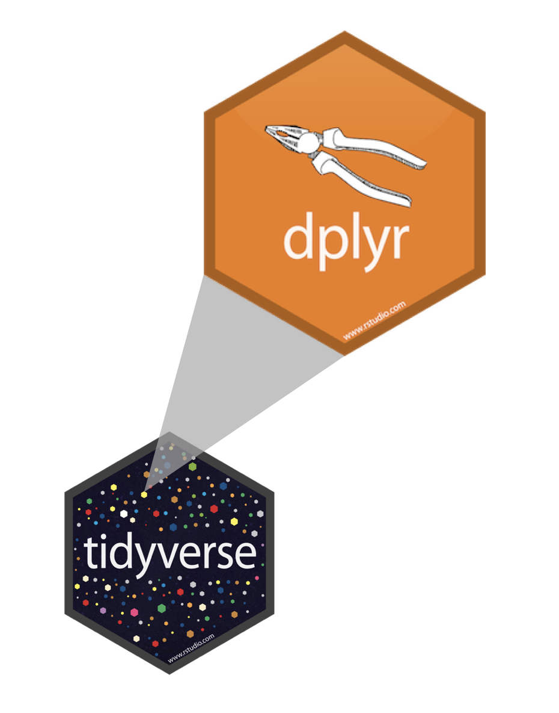

```{r setup, include=FALSE}
knitr::opts_chunk$set(warning = FALSE, message = FALSE, 
                      fig.retina = 3, fig.align = "center")
```


```{r xaringanExtra, echo=FALSE}
xaringanExtra::use_xaringan_extra(c("tile_view"))
```

class: center middle main-title section-title-1

# Data Validation

.class-info[

**Session 3**

.light[BEM 392: Math Business Capstone<br>
Lucy D'Agostino McGowan
]

]

---

class: title title-1

# Follow Along
<br><br>
.center[
# [bit.ly/bem-392-s22-slides-3](https://bit.ly/bem-392-s22-slides-3)
]
---

class: title title-1

# The plan

.box-1.medium[Column names as contracts]

--

.box-1.medium[Data cleaning in R]

--

.box-1.medium[Data validation tools]
---

class: center middle section-title section-title-1

# Column names are a way to align producers and consumers
.footer[Emily Riederer. Column names as contracts https://emilyriederer.netlify.app/talk/col-names-contract/slides.pdf]

---

class: title title-1

# Example

.small[
| term|
|----|
|ID|
|IND|
|YN|
|RANK|
|CAT|
|DT|
|TM|
]
.footer[Emily Riederer. Column names as contracts https://emilyriederer.netlify.app/talk/col-names-contract/slides.pdf]

---

class: title title-1

# Example

.small[
| term| semantics|
|----|-----------|
|ID| Unique identifier
|IND| Binary 0/1 indicator; rest of name describes condition 1
|YN| YES/NO variable
|RANK| Rank 1-5
|CAT| Human-readable categorical variable
|DT| Date of an event
|TM| Timestamp of event
]
.footer[Emily Riederer. Column names as contracts https://emilyriederer.netlify.app/talk/col-names-contract/slides.pdf]

---

class: title title-1
# Example

.small[
| term| semantics| contracts
|----|-----------|----------
|ID| Unique identifier | Numeric, primary key
|IND| Binary 0/1 indicator; rest of name describes condition 1 | Always 0 or 1
|YN| YES/NO variable | Always "Yes" or "No"
|VAL| Numeric | Numeric
|CAT| Human-readable categorical variable | --
|DT| Date of an event | Date, ISO 8601 (YYYY-MM-DD)
|TM| Timestamp of event | Datetime, YYYY-MM-DD HH:MM:SS
]
.footer[Emily Riederer. Column names as contracts https://emilyriederer.netlify.app/talk/col-names-contract/slides.pdf]

---

class: title title-1

# Example 
.pull-left-3[ 
.small[
| types|
|----|
|ID|
|IND|
|YN|
|VAL|
|CAT|
|DT|
|TM|
]
]

.pull-middle-3[
.small[
| question type|
|----|
|SEEN|
|FAN|
|FAVOR|
|RANK|
|DEMOGRAPHIC|
]
]

.pull-right-3[
.small[
| Details|
|----|
|STARWARS|
|STARTREK|
|GENDER|
|AGE|
|HAN_SOLO|
|LEIA|
|R2D2|
]
]

---

class: title title-1

# Example 

`YN_SEEN_{STARWARS | STARTREK}`  
`YN_FAN_{STARWARS | STARTREK | EXPANDED_UNIVERSE}`  
`CAT_FAVOR_{HAN_SOLO | LEIA | R2D2}`  
`VAL_RANK_{EPISODE_1 | EPISODE_2 | EPISODE_3 | EPISODE_4}`  
`IND_DEMOGRAPHIC_FEMALE`
`CAT_DEMOGRAPHIC_AGE`

---

class: title title-1

# Useful when making tables

```{r, eval = FALSE}
library(tidyverse)
library(gtsummary)

starwars_survey %>%
  select(starts_with("VAL"), contains("DEMOGRAPHIC"))
tbl_summary()
```

---

class: title title-1

# `r fontawesome::fa("laptop")` Application Exercise

.box-1[
Go to [bit.ly/bem-392-s22-rstudio](https://bit.ly/bem-392-s22-rstudio)
]


.box-inv-1[Save a **NEW** permanent copy (don't open your old version)]

--

.box-1[Open the README.md]
.box-1[Either click "Preview" or "Visual Editor"]
.box-1[How is the gender variable coded?]
.box-1[Is age continuous? or binned?]
.box-1[Find the file where the data is cleaned and open it.]

`r countdown::countdown(4, top = 0, font_size = "1em", margin = "5%")`
---

class: center middle main-title section-title-1

# Pipes %>%

.footer[Slides adapted from datasciencebox.org]
---

class: title title-1

# Where does the name come from?

The pipe operator is implemented in the package **magrittr**, it's pronounced 
"and then".

.pull-left[

]
.pull-right[

]
.footer[Slides adapted from datasciencebox.org]

---
class: title-1 title
# How does a pipe work?

- You can think about the following sequence of actions - find key, 
unlock car, start car, drive to school, park.
- Expressed as a set of nested functions in R pseudocode this would look like:
```{r eval = FALSE}
park(drive(start_car(find("keys")), to = "campus"))
```

.footer[Slides adapted from datasciencebox.org]


---
class: title-1 title
.footer[Slides adapted from datasciencebox.org]

# How does a pipe work?
```{r eval = FALSE}
park(drive(start_car(find("keys")), to = "campus"))
```
Writing it out using pipes give it a more natural (and easier to read) 
structure:
```{r eval = FALSE}
find("keys") %>%
  start_car() %>%
  drive(to = "campus") %>%
  park()
```

---
class: title title-1
# What about other arguments?
.footer[Slides adapted from datasciencebox.org]

To send results to a function argument other than first one or to use the previous result for multiple arguments, use `.`:

```{r eval = FALSE}
starwars %>%
  filter(species == "Human") %>%
  lm(mass ~ height, data = .)
```

---
class: center middle

</img>

.footer[Artwork by @allison_horst]

---

class: title title-1
.footer[Slides adapted from datasciencebox.org]

# A Grammar of Data Manipulation

**dplyr** is based on the concepts of functions as verbs that manipulate data frames.

.pull-left[
</img>
]
.pull-right[
.small[
- `filter`: pick rows matching criteria
- `select`: pick columns by name
- `arrange`: reorder rows
- `mutate`: add new variables
- `distinct`: filter for unique rows
- `summarise`: reduce variables to values
- ... (many more)
]
]

---

class: title title-1
.footer[Slides adapted from datasciencebox.org]

# **dplyr** rules for functions

- First argument is *always* a data frame
- Subsequent arguments say what to do with that data frame
- Always return a data frame
- Doesn't modify in place

---

class: title title-1
.footer[Slides adapted from datasciencebox.org]

# `filter` to select a subset of rows

for only Star Wars fans

.small[
```{r, eval = FALSE}
starwars_survey %>%
  filter(YN_FAN_STARWARS == "Yes") #<<
```
]

---

class: title title-1
.footer[Slides adapted from datasciencebox.org]

# `filter` for many conditions at once

for Star Wars fans who are Female

.small[
```{r, eval = FALSE}
starwars_survey %>%
  filter(YN_FAN_STARWARS == "Yes", IND_DEMOGRAPHIC_FEMALE == 1)
```
]

---
class: title title-1
.footer[Slides adapted from datasciencebox.org]

# Logical operators in R

operator    | definition                   || operator     | definition
------------|------------------------------||--------------|----------------
`<`         | less than                    ||`x`&nbsp;&#124;&nbsp;`y`     | `x` OR `y` 
`<=`        |	less than or equal to        ||`is.na(x)`    | test if `x` is `NA`
`>`         | greater than                 ||`!is.na(x)`   | test if `x` is not `NA`
`>=`        |	greater than or equal to     ||`x %in% y`    | test if `x` is in `y`
`==`        |	exactly equal to             ||`!(x %in% y)` | test if `x` is not in `y`
`!=`        |	not equal to                 ||`!x`          | not `x`
`x & y`     | `x` AND `y`                  ||              |

---

class: title title-1
.footer[Slides adapted from datasciencebox.org]

# `select` to keep variables

.small[
```{r, eval = FALSE}
starwars_survey %>%
  filter(YN_FAN_STARWARS == "Yes", IND_DEMOGRAPHIC_FEMALE == 1)
select(contains("RANK"))
```
]

---

class: title title-1
.footer[Slides adapted from datasciencebox.org]

# `select` to exclude variables

.small[
```{r, eval = FALSE}
starwars_survey %>%
  select(-ID)
```
]

---
class: title title-1
.footer[Slides adapted from datasciencebox.org]

# `select` a range of variables

.small[
```{r, eval = FALSE}
starwars_survey %>%
  select(YN_SEEN_EPISODE_1:YN_SEEN_EPISODE_6)
```
]


---
class: title title-1
.footer[Slides adapted from datasciencebox.org]

# `distinct` to filter for unique rows

And `arrange` to order alphabetically

.small[
```{r, eval = FALSE}
starwars_survey %>% 
  select(CAT_DEMOGRAPHIC_AGE, CAT_DEMOGRAPHIC_EDUCATION) %>% 
  distinct() %>% 
  arrange(CAT_DEMOGRAPHIC_AGE, CAT_DEMOGRAPHIC_EDUCATION)
```
]

---

class: title title-1
.footer[Slides adapted from datasciencebox.org]

# `group_by` to do calculations on groups

.small[
```{r, eval = FALSE}
starwars_survey %>%
  group_by(YN_SEEN_STARTREK) %>%
  summarise(avg_rank = mean(VAL_RANK_EPISODE_1, na.rm = TRUE))
```
]

---
class: title title-1
# `count` observations in groups
.footer[Slides adapted from datasciencebox.org]

.small[
```{r, eval = FALSE}
starwars_survey %>%
  count(YN_SEEN_STARWARS)
```
]

---
class: title title-1

# `mutate` to add new variables

.small[
```{r eval = FALSE}
starwars_survey %>%
  mutate(CAT_DEMOGRAPHIC_AGE_RECODE = case_when(
    is.na(CAT_DEMOGRAPHIC_AGE) ~ NA_character_,
    CAT_DEMOGRAPHIC_AGE %in% c("18-29", "30-44") ~ "18-44",
    CAT_DEMOGRAPHIC_AGE %in% c("45-60", "> 60") ~ "45+",
  ))
```
]

.center[
 </img>
]
.footer[Adapted from datasciencebox.org. Artwork by @allison_horst]
---
class: title title-1

# "Save" when you `mutate`
.footer[Slides adapted from datasciencebox.org]

Most often when you define a new variable with `mutate` you'll also want to save the resulting data frame, often by writing over the original data frame.

.small[
```{r, eval = FALSE}
starwars_survey <- starwars_survey %>% #<<
  mutate(CAT_DEMOGRAPHIC_AGE_RECODE = case_when(
    is.na(CAT_DEMOGRAPHIC_AGE) ~ NA_character_,
    CAT_DEMOGRAPHIC_AGE %in% c("18-29", "30-44") ~ "18-44",
    CAT_DEMOGRAPHIC_AGE %in% c("45-60", "> 60") ~ "45+",
  ))
```
]

---
class: title title-1

# "Save" when you `mutate`
.footer[Slides adapted from datasciencebox.org]

Most often when you define a new variable with `mutate` you'll also want to save the resulting data frame, often by writing over the original data frame.

.small[
```{r, eval = FALSE}
starwars_survey %>%
  mutate(CAT_DEMOGRAPHIC_AGE_RECODE = case_when(
    is.na(CAT_DEMOGRAPHIC_AGE) ~ NA_character_,
    CAT_DEMOGRAPHIC_AGE %in% c("18-29", "30-44") ~ "18-44",
    CAT_DEMOGRAPHIC_AGE %in% c("45-60", "> 60") ~ "45+",
  )) -> starwars_survey #<<
```
]

---
class: title title-1
.footer[Slides adapted from datasciencebox.org]

# Check before you move on

.small[
```{r, eval = FALSE}
starwars_survey %>% 
  count(CAT_DEMOGRAPHIC_AGE_RECODE, CAT_DEMOGRAPHIC_AGE)
```


]

---

class: title title-1

# `r fontawesome::fa("laptop")` Application Exercise


.box-1[Open `code/02-clean-data.R`]

.box-1[Examine lines 8 - 13. What is happening? Add a comment to explain]

.box-1[Create a new variable `CAT_DEMOGRAPHIC_AGE_2` that has two categories: <30, 30+]

.box-1[Run a check in the Console to make sure this worked]

.box-1[Write your data to `data/cleaned-data/data.csv`]

.box-1[Add new variable to the data dictionary in the README]

`r countdown::countdown(8, top = 0, font_size = "1em", margin = "5%")`

---

class: title title-1

# Tidy selection

.pull-left[
.box-inv-1[Anywhere you can `select()` columns by name]
]
---
class: title title-1

# Tidy selection

.pull-left[
.box-inv-1[Anywhere you can `select()` columns by name]

.box-1[Data cleaning]

]
---
class: title title-1

# Tidy selection

.pull-left[
.box-inv-1[Anywhere you can `select()` columns by name]

.box-1[Data cleaning]

.box-1[Creating tables `gtsummary`]

]

---


class: title title-1

# Tidy selection

.pull-left[
.box-inv-1[Anywhere you can `select()` columns by name]

.box-1[Data cleaning]

.box-1[Creating tables `gtsummary`]

.box-1[Data validation]
]
---

class: title title-1

# Tidy selection

.pull-left[
.box-inv-1[Anywhere you can `select()` columns by name]

.box-1[Data cleaning]

.box-1[Creating tables `gtsummary`]

.box-1[Data validation]
]

.pull-right[
.small[
- `everything()`: all variables.
- `last_col()`: Select last variable
- `starts_with()`
- `ends_with()`
- `contains()`
- `matches()`: Matches a regular expression.
- `num_range()`: Matches a numerical range like x01, x02, x03.
- `all_of()`
- `where()`: Applies a function to all variables and selects those for which the function returns TRUE.
]
]
---

class: title title-1

# Tidy select example: cleaning

```{r, eval = FALSE}
starwars_survey <- starwars_survey %>%
  mutate(across(starts_with("YN"), toupper)) 
```

---

class: title title-1

# Tidy select example: cleaning

```{r, eval = FALSE}
starwars_survey <- starwars_survey %>%
  mutate(across(starts_with("YN"), toupper)) #<<
```

---
class: title title-1

# Tidy select example: tables

```{r, eval = FALSE}
library(gtsummary)

starwars_survey %>%
  select(contains("DEMOGRAPHIC")) %>%
  tbl_summary()
```

---
class: title title-1

# Tidy select example: tables

```{r, eval = FALSE}
library(gtsummary)

starwars_survey %>%
  select(contains("DEMOGRAPHIC")) %>%
  tbl_summary()
```

---

class: title title-1

# Tidy select example: tables

```{r, eval = FALSE}
library(gtsummary)

starwars_survey %>%
  select(contains("DEMOGRAPHIC")) %>% #<<
  tbl_summary()
```

---
class: title title-1

# Tidy select example: calculations

.small[
```{r, eval = FALSE}
starwars_survey %>%
  summarise(across(contains("RANK"), median, na.rm = TRUE)) 
```
]

---
class: title title-1

# Tidy select example: calculations

```{r, include = FALSE}
library(tidyverse)
starwars_survey <- read_csv("data/starwars_survey.csv")
```

.small[
```{r}
starwars_survey %>%
  summarise(across(contains("RANK"), median, na.rm = TRUE)) #<<
```
]

---

</img>

.footer[Iannone R, Vargas M (2022). pointblank: Data Validation and Organization of Metadata for Local and Remote Tables. https://rich-iannone.github.io/pointblank/]

---


---

class:title-1 title

# {pointblank}

.pull-left-3[
.small[
- `col_vals_lt()`: Are column data less than a specified value?
- `col_vals_equal()`: equal to a specified value?
- `col_vals_gte()`: greater than or equal to a specified value?
- `col_vals_between()`: between two values?
]
]

.pull-middle-3[
.small[
- `col_vals_in_set()`: Are column data part of a set?
- `col_vals_not_null()`: not `NULL`/`NA`?
- `rows_distinct()`: rows distinct?
- `col_is_character()`: contain character data?
- `col_is_numeric()`: contain numeric values?
]
]

.pull-right-3[
.small[
- `col_is_integer()`: Do the columns contain integer values?
- `col_is_logical()`: contain logical values?
- `col_is_date()`: contain R `Date` objects?
- `col_is_factor()`: contain R `factor` objects?
 function]]
 
---

class: section-title middle section-title-1 

## [rich-iannone.github.io/pointblank](https://rich-iannone.github.io/pointblank)

---

class: title title-1

# Example

```{r, eval = FALSE}
library(pointblank)
starwars_survey %>%
  create_agent() %>%
  col_vals_not_null("ID") %>%
  rows_distinct("ID") %>%
  col_is_character(starts_with("CAT")) %>%
  col_vals_between(contains("RANK"), 0, 6, na_pass = TRUE) %>%
  interrogate()
```

---
class: title title-1

# Example


```{r, eval = FALSE}
library(pointblank) #<<
starwars_survey %>%
  create_agent() %>%
  col_vals_not_null("ID") %>%
  rows_distinct("ID") %>%
  col_is_character(starts_with("CAT")) %>%
  col_vals_between(contains("RANK"), 0, 6, na_pass = TRUE) %>%
  interrogate()
```

---

class: title title-1

# Example


```{r, eval = FALSE}
library(pointblank)
starwars_survey %>% #<<
  create_agent() %>% #<<
  col_vals_not_null("ID") %>%
  rows_distinct("ID") %>%
  col_is_character(starts_with("CAT")) %>%
  col_vals_between(contains("RANK"), 0, 6, na_pass = TRUE) %>%
  interrogate()
```
---

class: title title-1

# Example


```{r, eval = FALSE}
library(pointblank)
starwars_survey %>%
  create_agent() %>%
  col_vals_not_null("ID") %>% #<<
  rows_distinct("ID") %>%
  col_is_character(starts_with("CAT")) %>%
  col_vals_between(contains("RANK"), 0, 6, na_pass = TRUE) %>%
  interrogate()
```
---

class: title title-1

# Example


```{r, eval = FALSE}
library(pointblank)
starwars_survey %>%
  create_agent() %>%
  col_vals_not_null("ID") %>%
  rows_distinct("ID") %>%
  col_is_character(starts_with("CAT")) %>% #<<
  col_vals_between(contains("RANK"), 0, 6, na_pass = TRUE) %>%
  interrogate()
```
---

class: title title-1

# Example


```{r, eval = FALSE}
library(pointblank)
starwars_survey %>%
  create_agent() %>%
  col_vals_not_null("ID") %>%
  rows_distinct("ID") %>%
  col_is_character(starts_with("CAT")) %>%
  col_vals_between(contains("RANK"), 0, 6, na_pass = TRUE) %>% #<<
  interrogate()
```
---

class: title title-1

# Example


```{r, eval = FALSE}
library(pointblank)
starwars_survey %>%
  create_agent() %>%
  col_vals_not_null("ID") %>%
  rows_distinct("ID") %>%
  col_is_character(starts_with("CAT")) %>%
  col_vals_between(contains("RANK"), 0, 6, na_pass = TRUE) %>%
  interrogate() #<<
```
---
class: title title-1


# Example

```{r, echo = FALSE}
library(pointblank)
starwars_survey %>%
  create_agent() %>%
  col_vals_not_null("ID") %>%
  rows_distinct("ID") %>%
  col_is_character(starts_with("CAT")) %>%
  col_vals_between(contains("RANK"), 0, 6, na_pass = TRUE) %>%
  interrogate()
```

---
class: title title-1


# Example

```{r, eval = FALSE}
library(pointblank)
starwars_survey %>%
  create_agent() %>% 
  col_vals_in_set("YN_SEEN_EPISODE_1", set = c("Yes", "No")) %>%  #<<
  interrogate()
```
---
class: title title-1


# Example

```{r, echo = FALSE}
library(pointblank)
starwars_survey %>%
  create_agent() %>% 
  col_vals_in_set("YN_SEEN_EPISODE_1", set = c("Yes", "No")) %>%  #<<
  interrogate()
```
---

class: title title-1


# Example

```{r, eval = FALSE}
library(pointblank)
starwars_survey %>%
  create_agent(actions = action_levels(warn_at = 0.1)) %>% #<<
  col_vals_in_set("YN_SEEN_EPISODE_1", set = c("Yes", "No")) %>% 
  interrogate()
```

---
class: title title-1


# Example

```{r, echo = FALSE}
library(pointblank)
starwars_survey %>%
  create_agent(actions = action_levels(warn_at = 0.1)) %>% #<<
  col_vals_in_set("YN_SEEN_EPISODE_1", set = c("Yes", "No")) %>% 
  interrogate()
```

---

class: title title-1


# Example

```{r, eval = FALSE}
library(pointblank)
starwars_survey %>%
  create_agent(actions = action_levels(warn_at = 0.1)) %>% 
  col_vals_in_set("YN_SEEN_EPISODE_1", set = c("Yes", "No", NA_character_)) %>% #<< 
  interrogate()
```

---


class: title title-1


# Example

```{r, echo = FALSE}
library(pointblank)
starwars_survey %>%
  create_agent(actions = action_levels(warn_at = 0.1)) %>% 
  col_vals_in_set("YN_SEEN_EPISODE_1", set = c("Yes", "No", NA_character_)) %>%
  interrogate()
```

---


class: title title-1

# `r fontawesome::fa("laptop")` Application Exercise


.box-1[Open `reports/report.Rmd`]

.box-1[Create the following data checks:]

.box-1[Your new variable `CAT_DEMOGRAPHIC_AGE_2` has two categories: <30, 30+]

.box-1[All Yes/No variables contain only "Yes" or "No"]

.box-1[All "FAVOR" variables have the right categories]

`r countdown::countdown(15, top = 0, font_size = "1em", margin = "5%")`

---

class: title title-1

# Learn more!

- [Emily Riederer's](https://twitter.com/emilyriederer) Column Names as Contracts [[blog](https://emilyriederer.netlify.app/post/column-name-contracts/)]

- [Rich Iannone's](https://twitter.com/riannone) {pointblank} Website [[package](https://rich-iannone.github.io/pointblank/)]
