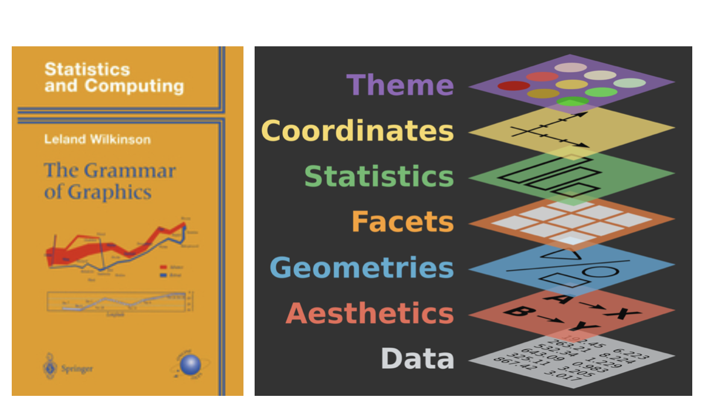
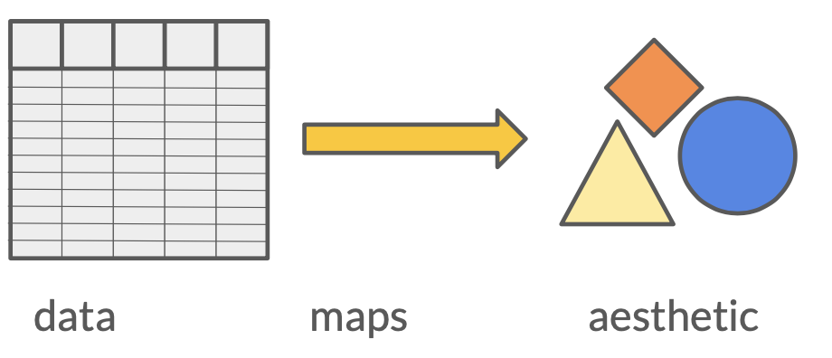
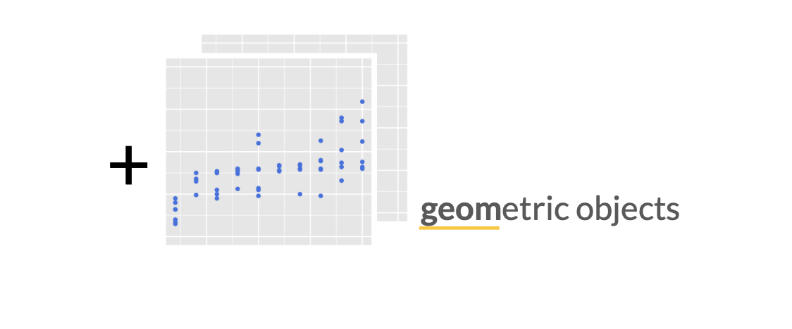
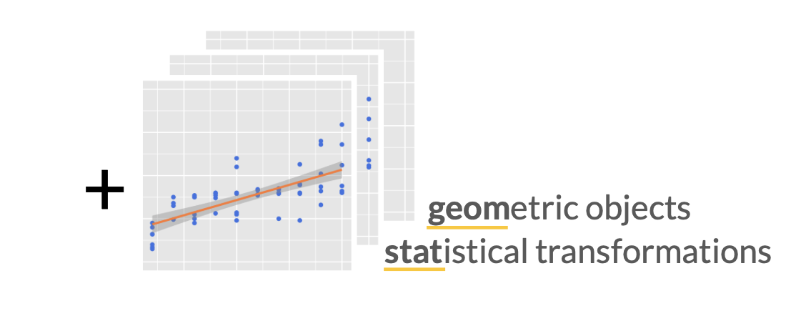
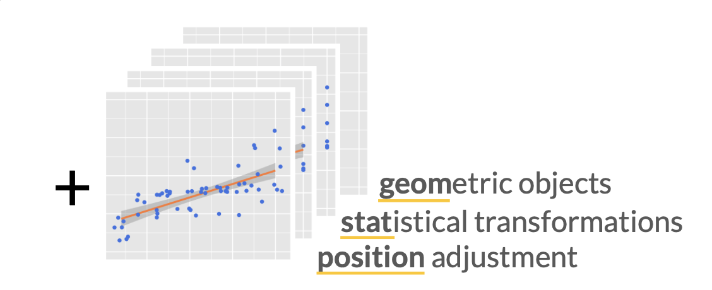
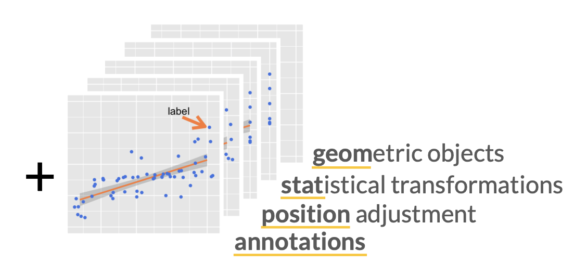
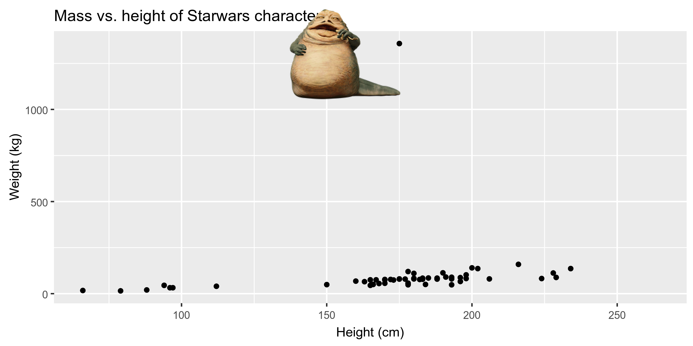

```{r setup, include=FALSE}
knitr::opts_chunk$set(warning = FALSE, message = FALSE, 
                      fig.retina = 3, fig.align = "center")
```


```{r xaringanExtra, echo=FALSE}
xaringanExtra::use_xaringan_extra(c("tile_view"))
```

class: center middle main-title section-title-1

# Data Visualization

.class-info[

**Session 4**

.light[BEM 392: Math Business Capstone<br>
Lucy D'Agostino McGowan
]

]

---

class: title title-1

# Follow Along
<br><br>
.center[
# [bit.ly/bem-392-s22-slides-4](https://bit.ly/bem-392-s22-slides-4)
]

---

class: title title-1

# `r fontawesome::fa("laptop")` Application Exercise

.box-1[
Go to [bit.ly/bem-392-s22-rstudio](https://bit.ly/bem-392-s22-rstudio)
]

.box-1[Open `code\03-generate-figures.R`]

.box-1.small[We want to extract rows based on the following logical criteria: only include rows where the respondent's age is between 18-29. Edit the code below to do that.]

.small[
```{r, eval = FALSE}
young_starwars_survey <- starwars_survey %>%
  ------(CAT_DEMOGRAPHIC_AGE == -----)
```
]

.box-1.small[Hint: Don't remember how to filter rows? Find the `dplyr` Cheatsheet under `Help > Cheatsheats > Data transformations with dplyr`]
`r countdown::countdown(4, top = 0, font_size = "1em", margin = "5%")`

---

class: title title-1

# Good visualizations

.box-1.medium[Reveal structure]

--

.box-1.medium[Show data]

--

.box-1.medium[Properly scaled]

--

.box-1.medium[Sensibly arranged]

--

.box-1.medium[Draw attention to the key points]
---

class: title title-1

# ggplot2 $\in$ tidyverse
.footer[ 
Adapted from datasciencebox.com <sup>†</sup> Source: [BloggoType](http://bloggotype.blogspot.com/2016/08/holiday-notes2-grammar-of-graphics.html)
]
.pull-left-3[
 </img>
]

.pull-middle-3[
</img>
]
.pull-right-3[
.small[
- **ggplot2** is tidyverse's data visualization package
- The `gg` in "ggplot2" stands for Grammar of Graphics
- It is inspired by the book **Grammar of Graphics** by Leland Wilkinson <sup>†</sup>
]
]


---
class: title title-1
# ggplot2 components

- **data**
- **aes**thetic mapping
- layer(s)

---
class: title title-1

# ggplot2 premise



---
class: title title-1

# Hello ggplot2!


---
class: title title-1

# Hello ggplot2!



---
class: title title-1

# Hello ggplot2!



---
class: title title-1

# Hello ggplot2!



---
class: title title-1

# Hello ggplot2!



---
class: title title-1

# Hello ggplot2!
.footer[Adapted from datasciencebox.org]

- `ggplot()` is the main function in ggplot2 and plots are constructed in layers
- The structure of the code for plots can often be summarized as

.small[
```{r eval = FALSE}
ggplot + 
  geom_xxx
```
]

--

or, more precisely

.small[
```{r eval = FALSE}
ggplot(data = [dataset], mapping = aes(x = [x-variable], y = [y-variable])) +
  geom_xxx() +
  other options
```
]

---
class: title title-1

# Hello ggplot2!
.footer[Adapted from datasciencebox.org]

- To use ggplot2 functions, first load tidyverse

```{r}
library(tidyverse)
```

--
.small[
- For help with the ggplot2, see [ggplot2.tidyverse.org](http://ggplot2.tidyverse.org/)  
- `Help > Cheatsheats > Data Visualizations in ggplot`
]
---

class: title title-1
.footer[Adapted from datasciencebox.org]
# Mass vs. height

.pull-left[
.small[
```{r eval = FALSE}
ggplot(data = starwars, 
       mapping = aes(
         x = height, 
         y = mass)) +
  geom_point()
```
]
]

.pull-right[
```{r echo = FALSE, fig.height = 5}
ggplot(data = starwars, 
       mapping = aes(
         x = height, y = mass)) +
  geom_point()
```
]

---
class: title title-1
.footer[Adapted from datasciencebox.org]
# What's that warning?

- Not all characters have height and mass information (hence 28 of them not plotted)

.small[
```
## Warning: Removed 28 rows containing missing values (geom_point).
```
]

- Going forward I'll suppress the warning to save room on slides, but it's important to note it

---
class: title title-1
.footer[Adapted from datasciencebox.org]
# Mass vs. height

.pull-left[
.small[
```{r eval = FALSE}
ggplot(data = starwars,
       mapping = aes(
         x = height, 
         y = mass)) +
  geom_point() +
  labs(title = "Mass vs. height of Starwars characters", #<<
       x = "Height (cm)", #<<
       y = "Weight (kg)")             #<<
```
]

]

.pull-right[
```{r echo = FALSE, fig.height = 5, warning=FALSE}
ggplot(data = starwars, mapping = aes(x = height, y = mass)) +
  geom_point() +
  labs(title = "Mass vs. height of Starwars characters", #<<
       x = "Height (cm)", y = "Weight (kg)")             #<<
```
]

---
class: title title-1
.footer[Adapted from datasciencebox.org]
# Jabba!

```{r echo=FALSE, warning=FALSE, cache=TRUE, eval = FALSE}
library(magick)
jabba <- image_read("img/02/jabba.png")

fig <- image_graph(width = 2400, height = 1200, res = 300)
ggplot(data = starwars, mapping = aes(x = height, y = mass)) +
  geom_point(size = 1.5) + 
  labs(title = "Mass vs. height of Starwars characters",
       x = "Height (cm)", y = "Weight (kg)")
dev.off()

out <- fig %>% image_composite(jabba, offset = "+1000+30")

image_write(out, "img/02/jabbaplot.png", format = "png")

```

</img>

---
class: title title-1
.footer[Adapted from datasciencebox.org]
# Additional variables

We can map additional variables to various features of the plot:

- aesthetics
- color
- size
- shape
- alpha (transparency)
- faceting: small multiples displaying different subsets

---

class: section-title section-title-1 center, middle

# Aesthetics

---
class: title title-1
.footer[Adapted from datasciencebox.org]
# Aesthetics options

Visual characteristics of plotting characters that can be **mapped to a specific variable**
in the data are

- `color`
- `size`
- `shape`
- `alpha` (transparency)

---
class: title title-1
.footer[Adapted from datasciencebox.org]
# Mass vs. height + gender

.pull-left[
.small[
```{r eval = FALSE}
ggplot(data = starwars,
       mapping = aes(
         x = height, 
         y = mass, 
         color = gender)) +
  geom_point()
```
]
]

.pull-right[
```{r echo = FALSE, warning = FALSE, fig.height = 5}
ggplot(data = starwars,
       mapping = aes(x = height, y = mass, color = gender)) +
  geom_point()
```
]
---
class: title title-1
.footer[Adapted from datasciencebox.org]
# Mass vs. height + gender

.pull-left[
.small[
```{r eval = FALSE}
ggplot(data = starwars,
       mapping = aes(
         x = height, 
         y = mass, 
         color = gender, 
         size = birth_year #<<
       )) +
  geom_point()
```
]
]

.pull-right[
```{r echo = FALSE, fig.height=5, warning=FALSE}
ggplot(data = starwars,
       mapping = aes(
         x = height, 
         y = mass, 
         color = gender, 
         size = birth_year #<<
       )) +
  geom_point()
```
]

---
class: title title-1
.footer[Adapted from datasciencebox.org]
# Mass vs. height + gender

.pull-left[
.small[
```{r eval = FALSE}
ggplot(data = starwars, 
       mapping = aes(
         x = height, 
         y = mass, 
         color = gender)) +
  geom_point(size = 2) #<<
```
]
]

.pull-right[
```{r echo = FALSE, warning = FALSE, fig.height = 5}
ggplot(data = starwars, 
       mapping = aes(
         x = height, 
         y = mass, 
         color = gender)) +
  geom_point(size = 2) #<<
```
]

---
class: title title-1
.footer[Adapted from datasciencebox.org]
# Aesthetics summary

.small[
- Continuous variable are measured on a continuous scale
- Discrete variables are measured (or often counted) on a discrete scale
]
.small[


aesthetics    | discrete                 | continuous
------------- | ------------------------ | ------------
color         | rainbow of colors        | gradient
size          | discrete steps           | linear mapping between radius and value
shape         | different shape for each | shouldn't (and doesn't) work

]
- Use aesthetics for mapping features of a plot to a variable, define the features in the geom for customization **not** mapped to a variable

---

class: section-title section-title-1 center, middle

# Faceting

---
class: title title-1
.footer[Adapted from datasciencebox.org]
# Faceting options

.small[
- Smaller plots that display different subsets of the data
- Useful for exploring conditional relationships and large data
]
.pull-left[
.small[
```{r eval = FALSE}
ggplot(data = starwars, 
       mapping = aes(x = height, 
                     y = mass)) +
  facet_grid(. ~ gender) + #<<
  geom_point() +
  labs(title = "Mass vs. height of Starwars characters",
       subtitle = "Faceted by gender",  #<<
       x = "Height (cm)", 
       y = "Weight (kg)")
```
]
]
.pull-right[
```{r echo = FALSE, warning=FALSE, fig.height = 5}
ggplot(data = starwars, mapping = aes(x = height, y = mass)) +
  facet_grid(. ~ gender) + #<<
  geom_point() +
  labs(title = "Mass vs. height of Starwars characters",
       subtitle = "Faceted by gender",  #<<
       x = "Height (cm)", y = "Weight (kg)")
```
]

---
class: title title-1
.footer[Adapted from datasciencebox.org]
# Facet summary

- `facet_grid()`: 
- 2d grid
- `rows ~ cols`
- use `.` for no split
- `facet_wrap()`: 1d ribbon wrapped into 2d

---

class: title title-1

# More ggplot2 info:

.box-1.medium[ggplot2 in 2]

.box-1.medium[[https://leanpub.com/ggplot2in2/c/bem-392-s22](https://leanpub.com/ggplot2in2/c/bem-392-s22)]

---
class: title title-1

# `r fontawesome::fa("laptop")` Application Exercise


.box-1[Add the following code to your `03-generate-figures.R` file]

```{r, eval = FALSE}
ggplot(young_starwars_survey, 
       aes(x = VAL_RANK_EPISODE_1, y = CAT_FAVOR_PADME)) + 
  labs(x = "------",
       y = "------")
```

.box-1[What is going to be on the x-axis? What is going to be on the y-axis? Fill in the `x` and `y` labels.]

.box-1.small[Find the `ggplot` Cheatsheet under `Help > Cheatsheats > Data Visualizations with ggplot2`]

`r countdown::countdown(4, top = 0, font_size = "1em", margin = "5%")`
.box-1.small[Find the `ggplot` Cheatsheet under `Help > Cheatsheats > Data Visualizations with ggplot2`]
---

class: title title-1

# Good visualizations

.box-1.medium[Reveal structure]


.box-2.medium[Show data]


.box-2.medium[Properly scaled]


.box-2.medium[Sensibly arranged]


.box-2.medium[Draw attention to the key points]
---

class: title title-1

# Reveal Structure


```{r, message = FALSE, warning = FALSE, echo = FALSE}
library(tidyverse)
library(geomtextpath)
library(datasauRus)
set.seed(1)
x <- tibble(
  x = c(rnorm(100, 40, 4), rnorm(100, 20, 4))
)

ggplot(x, aes(x)) +
  geom_histogram(fill = "cornflower blue") +
  theme_minimal() + 
  geom_textvline(xintercept = 30, label = "Average", lty = 2, vjust = -0.2, hjust = 0.9,
                 size = 10, color = "dark blue") + 
  theme(
    panel.grid = element_blank(),
    axis.title = element_blank(),
    axis.text = element_blank(),
    axis.ticks = element_blank()) 
```

---


class: title title-1
# Reveal structure

```{r, echo = FALSE}
datasaurus_dozen %>%
  filter(dataset != "wide_lines") %>%
  ggplot(aes(x = x, y = y, colour = dataset)) +
  geom_smooth(method = "lm") +
  theme_minimal() +
  theme(legend.position = "none",
        strip.text.x = element_blank()) +
  facet_wrap( ~ dataset, ncol = 3)
```

---

class: title title-1

# Reveal Structure

```{r, echo = FALSE}
datasaurus_dozen %>%
  filter(dataset != "wide_lines") %>%
  ggplot(aes(x = x, y = y, colour = dataset)) +
  geom_smooth(method = "lm") +
  geom_point() +
  theme_minimal() +
  theme(legend.position = "none",
        strip.text.x = element_blank()) +
  facet_wrap( ~ dataset, ncol = 3)
```


---

class: title title-1

# Data types

.box-1[`r emo::ji("ruler")` Continuous]

--

.box-1[`r emo::ji("bar_chart")` Categorical]

--

.box-1[`r emo::ji("chicken")` `r emo::ji("unicorn")` `r emo::ji("giraffe")` Nominal]

--

.box-1[`r emo::ji("slightly_smiling_face")` `r emo::ji("neutral_face") ``r emo::ji("slightly_frowning_face")` Ordinal]

---

class: section-title section-title-1 center, middle

# Visualizing numerical data

---
class: title title-1

.footer[Adapted from datasciencebox.org]
# Describing shapes of numerical distributions

* shape:
* skewness: right-skewed, left-skewed, symmetric (skew is to the side of the longer tail)
* modality: unimodal, bimodal, multimodal, uniform
* center: mean (`mean`), median (`median`), mode (not always useful)
* spread: range (`range`), standard deviation (`sd`), inter-quartile range (`IQR`)
* unusual observations

---
class: title title-1

.footer[Adapted from datasciencebox.org]
# Histograms

.small[
```{r fig.width = 7, fig.height = 4, message = FALSE, warning = FALSE}
ggplot(data = starwars, mapping = aes(x = height)) +
  geom_histogram(binwidth = 10)
```
]

---
class: title title-1

.footer[Adapted from datasciencebox.org]
# Density plots

.small[
```{r fig.width = 7, fig.height = 4, message = FALSE, warning = FALSE}
ggplot(data = starwars, mapping = aes(x = height)) +
  geom_density()
```
]

---
class: title title-1

.footer[Adapted from datasciencebox.org]
# Side-by-side box plots

.small[
```{r fig.width = 7, fig.height = 4, message = FALSE, warning = FALSE}
ggplot(data = starwars, mapping = aes(y = height, x = gender)) +
  geom_boxplot()
```
]

---
class: title title-1

.footer[Adapted from datasciencebox.org]
# Side-by-side box plots

.small[
```{r fig.width = 7, fig.height = 4, message = FALSE, warning = FALSE}
ggplot(data = starwars, mapping = aes(y = height, x = gender)) +
  geom_boxplot(outlier.shape = NA) + 
  geom_jitter()
```
]


---

class: section-title section-title-acenter, middle

# Visualizing categorical data

---
class: title title-1

.footer[Adapted from datasciencebox.org]
# Bar plots

.small[
```{r fig.width = 7, fig.height = 4}
ggplot(data = starwars, mapping = aes(x = gender)) +
  geom_bar()
```
]

---
class: title title-1

.footer[Adapted from datasciencebox.org]
# Segmented bar plots, counts

.small[
```{r fig.width = 7, fig.height = 4}
ggplot(data = starwars,
       mapping = aes(x = gender, fill = hair_color)) +
  geom_bar()
```
]

---
class: title title-1

.footer[Adapted from datasciencebox.org]
# Segmented bar plots, proportions

.small[
```{r fig.width = 7, fig.height = 4}
ggplot(data = starwars, 
       mapping = aes(x = gender, fill = hair_color)) +
  geom_bar(position = "fill") +
  labs(y = "proportion")
```
]


---

class: title title-1

# Good visualizations

.box-2.medium[Reveal structure]

.box-1.medium[Show data]

.box-2.medium[Properly scaled]

.box-2.medium[Sensibly arranged]


.box-2.medium[Draw attention to the key points]
---

class: title title-1

# Show data

```{r, echo = FALSE}
set.seed(928)
data.frame(x = c(rnorm(5, 10, 1), rnorm(25, 12, 4), rnorm(100, 5, 1)), 
           y = c(rep(1, 5), rep(2, 25), rep(3, 100))) -> d

d %>%
  ggplot(aes(x = y, y = x)) + 
  stat_summary(fill =  "cornflower blue", aes(width = .8), geom = "bar", fun.y = "mean") +
  stat_summary(geom = "errorbar", fun.data = "mean_se", width = .5, color = "dark blue", lwd = 1.5) + 
  ylim(c(0, 15)) + 
  theme_minimal() + 
  theme(
    panel.grid = element_blank(),
    axis.title = element_blank(),
    axis.text = element_blank(),
    axis.ticks = element_blank()) 
```

---

class: title title-1

# Show data

```{r, echo = FALSE}

ggplot(d, aes(x = y, y = x)) + 
  stat_summary(fill =  "cornflower blue", aes(width = .8), geom = "bar", fun.y = "mean") +
  stat_summary(geom = "errorbar", fun.data = "mean_se", lwd = 2, color = "dark blue", width = .5) + 
  geom_jitter(alpha = 0.5, size = 3, color = "dark blue") +
  theme_minimal() +
  theme(
    panel.grid = element_blank(),
    axis.title = element_blank(),
    axis.text = element_blank(),
    axis.ticks = element_blank()) +
  ylim(c(0, 15))

```


---
class: title title-1

# `r fontawesome::fa("laptop")` Application Exercise

.box-1[Plot `VAL_RANK_EPISODE_1` by `CAT_FAVOR_PADME` among young survey respondents]

```{r, echo = FALSE, fig.height = 4}
d <- read_csv("data/starwars_survey.csv")
d %>%
  filter(CAT_DEMOGRAPHIC_AGE == "18-29") %>%
#  filter(!is.na(CAT_FAVOR_PADME)) %>%
  ggplot(aes(VAL_RANK_EPISODE_1, CAT_FAVOR_PADME)) + 
  geom_boxplot(outlier.shape = NA) +
  geom_jitter(alpha = 0.25) + 
  xlab("Episode 1 Ranking") + 
  ylab("How favorable is Padme?") +
  theme(axis.text = element_text(size = 15))
```


.box-1[Hint, you'll need to add `geom_jitter()`]


`r countdown::countdown(4, top = 0, font_size = "1em", margin = "5%")`


---

class: title title-1

# Good visualizations

.box-2.medium[Reveal structure]

.box-2.medium[Show data]

.box-1.medium[Properly scaled]

.box-2.medium[Sensibly arranged]

.box-2.medium[Draw attention to the key points]
---

class: title title-1

# Properly scaled

```{r, echo = FALSE}
starwars %>%
  filter(mass < 1000) %>%
  ggplot(aes(x = height, y = mass)) +
  geom_point(color = "cornflower blue", size = 3) + 
  theme_minimal() +
  theme(axis.title = element_blank(),
        axis.text.x = element_blank(),
        axis.ticks.x = element_blank(),
        axis.text.y = element_text(size = 20))
```

---

class: title title-1

# Properly scaled

```{r, echo = FALSE}
starwars %>%
  filter(mass < 1000) %>%
  ggplot(aes(x = height, y = mass)) +
  geom_point(color = "cornflower blue", size = 4) + 
  theme_minimal() +
  theme(axis.title = element_blank(),
        axis.text.x = element_blank(),
        axis.ticks.x = element_blank(),
        axis.text.y = element_text(size = 20)) +
  ylim(c(0, 5000))
```

---

class: title title-1

# Properly scaled

```{r, echo = FALSE}
starwars %>%
  filter(mass < 1000) %>%
  ggplot(aes(x = height, y = mass)) +
  geom_point(color = "cornflower blue", size = 4) + 
  theme_minimal() +
  theme(axis.title = element_blank(),
        axis.text.x = element_blank(),
        axis.ticks.x = element_blank(),
        axis.text.y = element_text(size = 20))
```


---

class: title title-1

# Properly scaled

```{r, echo = FALSE}
mean  <- c(95, 99) 
l <- c(94, 98)
u <- c(96, 100)

data.frame(lab = letters[1:2], mean, l, u) %>%
  ggplot(aes(x = lab, y = mean, ymin = l, ymax = u)) +
  geom_pointrange(color = "cornflower blue", size = 3) + 
  coord_flip() +
  theme_minimal() +
  theme(axis.title = element_blank(),
        axis.text.y = element_blank(),
        axis.ticks.y = element_blank(),
        axis.text.x = element_text(size = 20))
```

---

class: title title-1

# Properly scaled

```{r, echo = FALSE}

data.frame(lab = letters[1:2], mean, l, u) %>%
  ggplot(aes(x = lab, y = mean, ymin = l, ymax = u)) +
  geom_pointrange(color = "cornflower blue", size = 3) + 
  coord_flip() +
  theme_minimal() +
  theme(axis.title = element_blank(),
        axis.text.y = element_blank(),
        axis.ticks.y = element_blank(),
        axis.text.x = element_text(size = 20)) +
  ylim(c(0, 100))
```

---

class: title title-1

# Good visualizations

.box-2.medium[Reveal structure]


.box-2.medium[Show data]


.box-2.medium[Properly scaled]

.box-1.medium[Sensibly arranged]

.box-2.medium[Draw attention to the key points]
---

class: title title-1

# Sensibly arranged

```{r, echo = FALSE}
starwars %>%
  ggplot(aes(eye_color)) +
  geom_bar(fill = "cornflower blue") + 
  coord_flip() + 
  theme_void() 
```

---

class: title title-1
# Sensibly arranged

```{r, echo = FALSE}
starwars %>%
  ggplot(aes(fct_infreq(eye_color))) +
  geom_bar(fill = "cornflower blue") + 
  coord_flip() + 
  theme_void() 
```
---

class: title title-1
# Sensibly arranged

```{r, echo = FALSE}
tibble(film = unlist(starwars$films)) %>%
  ggplot(aes(film)) +
  geom_bar(fill = "cornflower blue") + 
  coord_flip() + 
  theme_minimal() +
  theme(panel.grid = element_blank(),
        axis.title = element_blank(),
        axis.ticks.x = element_blank(),
        axis.text.x = element_blank(),
        axis.text.y = element_text(size = 15))
```
---

class: title title-1
# Sensibly arranged

```{r, echo = FALSE}

tibble(film = unlist(starwars$films)) %>%
  mutate(film = fct_relevel(
    film,
    c(
      "The Phantom Menace",
      "Attack of the Clones",
      "Revenge of the Sith",
      "A New Hope",
      "The Empire Strikes Back",
      "Return of the Jedi",
      "The Force Awakens"
    )
  )) %>%
  ggplot(aes(fct_rev(film))) +
  geom_bar(fill = "cornflower blue") +
  coord_flip() +
  theme_minimal() +
  theme(
    panel.grid = element_blank(),
    axis.title = element_blank(),
    axis.ticks.x = element_blank(),
    axis.text.x = element_blank(),
    axis.text.y = element_text(size = 15)
  )
```

---
class: title title-1

# forcats $\in$ tidyverse

.pull-left[

.small[
```{r, eval = FALSE}
young_starwars_survey %>%
  mutate(
    CAT_FAVOR_PADME_ORDER = 
      fct_infreq(CAT_FAVOR_PADME)
    ) 
```
]
]

.pull-right[
- `fct_relevel()` relevel fators
- `fct_rev()` reverse factor
- `fct_infreq()` order by the number of observations in each level
- `fct_inorder()` order by the order in which they first appear in the dataset
]
---
class: title title-1

# `r fontawesome::fa("laptop")` Application Exercise

.box-1[Copy the code below to create a bar plot]


```{r, eval = FALSE}
ggplot(young_starwars_survey, 
       aes(x = CAT_FAVOR_PADME)) +
  geom_bar() + 
  coord_flip() + 
  labs(y = "------")
```

.box-1[Use the `fct_relevel()` function to properly order the bars by the favorability order]
`r countdown::countdown(4, top = 0, font_size = "1em", margin = "5%")`
---
class: title title-1

# Good visualizations

.box-2.medium[Reveal structure]


.box-2.medium[Show data]


.box-2.medium[Properly scaled]

.box-2.medium[Sensibly arranged]

.box-1.medium[Draw attention to the key points]

---
class: title title-1

# Draw attention to the key points


```{r, echo = FALSE}
starwars %>%
  mutate(key = ifelse(mass > 1000, "yes", "no")) %>%
  ggplot(aes(x = height, y = mass, color = key)) +
  geom_point(size = 4) + 
  scale_color_manual(values = c("cornflower blue", "orange")) + 
  theme_minimal() +
  theme(legend.position = "none", 
        axis.title = element_blank(),
        axis.text.x = element_blank(),
        axis.ticks.x = element_blank(),
        axis.text.y = element_text(size = 20))
```

---

class: title title-1

# `r fontawesome::fa("laptop")` Application Exercise

.box-1[Create a new variable `CAT_RANK_EPISODE_1` that categorizes the `VAL_RANK_EPISODE_1` to "< 5" or "5+"]

.box-1[Create a new variable `COLOR` that is "blue" if `CAT_FAVOR_PADME` is "Unfamiliar (N/A)" or "red" otherwise]

.box-1[Try to recreate the figure below.]

```{r, echo = FALSE}
d %>%
  filter(CAT_DEMOGRAPHIC_AGE == "18-29", !is.na(CAT_FAVOR_PADME)) %>%
  mutate(CAT_RANK_EPISODE_1 = case_when(
    VAL_RANK_EPISODE_1 < 5 ~ "Episode 1 ranking < 5",
    TRUE ~ "Episode 1 ranking 5+" 
  ),
  PAD = fct_relevel(CAT_FAVOR_PADME, 
                    c("Very favorably", "Somewhat favorably",  "Neither favorably nor unfavorably (neutral)", "Somewhat unfavorably", "Very unfavorably", "Unfamiliar (N/A)")),
  color_pad = case_when(
    PAD == "Unfamiliar (N/A)" ~ "red",
    TRUE ~ "blue"
  )) %>%
ggplot(aes(x = PAD, fill = color_pad)) +
  geom_bar() + 
  coord_flip() + 
  labs(y = "Padme Favorability",
       x = "Count") + 
  facet_wrap(~CAT_RANK_EPISODE_1) + 
  theme(legend.position = "none") 
```

.box-1[Use the `fct_relevel()` function to properly order the bars by the favorability order]
`r countdown::countdown(4, top = 0, font_size = "1em", margin = "5%")`

---
class: title title-1

# Good visualizations

.box-1.medium[Reveal structure]


.box-1.medium[Show data]


.box-1.medium[Properly scaled]

.box-1.medium[Sensibly arranged]

.box-1.medium[Draw attention to the key points]
