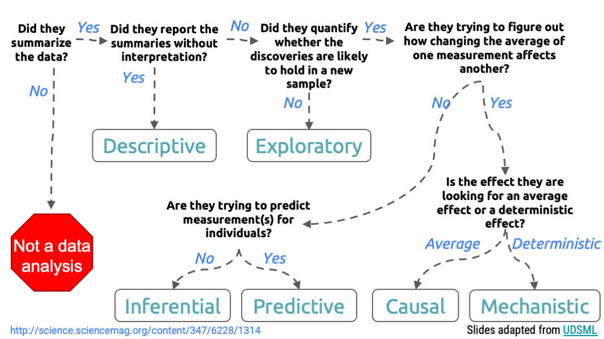
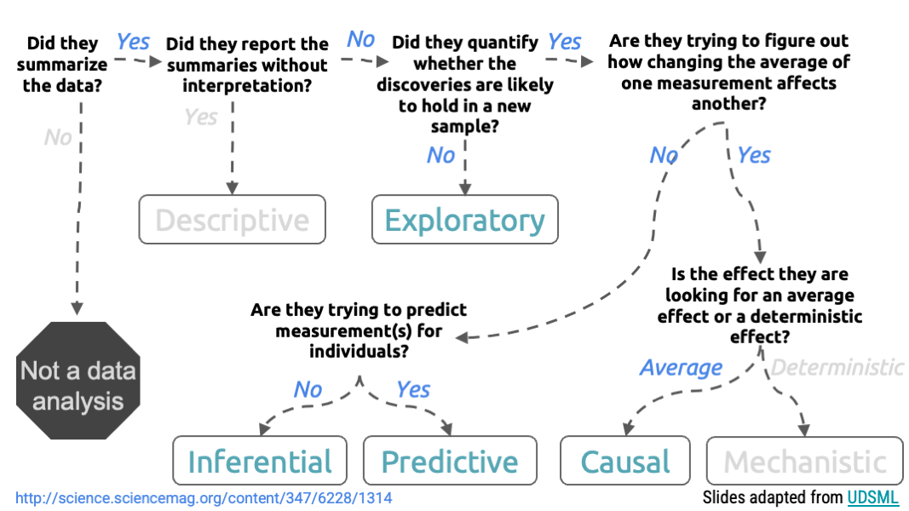
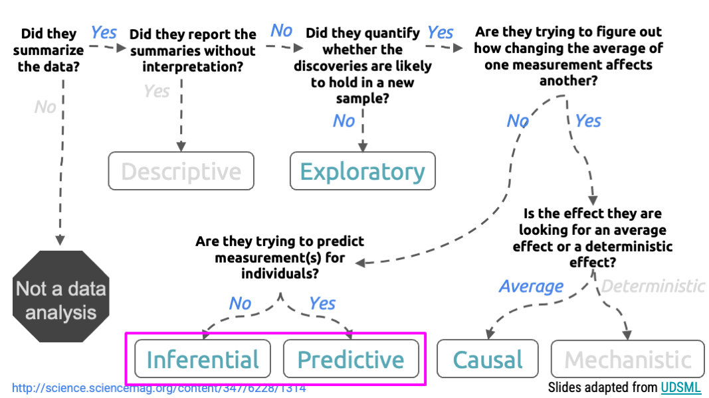

```{r setup, include=FALSE}
knitr::opts_chunk$set(warning = FALSE, message = FALSE, 
                      fig.retina = 3, fig.align = "center")
```


```{r xaringanExtra, echo=FALSE}
xaringanExtra::use_xaringan_extra(c("tile_view"))
```

class: center middle main-title section-title-1

# Variable Selection

.class-info[

**Session 7**

.light[BEM 392: Math Business Capstone<br>
Lucy D'Agostino McGowan
]

]

---
class: section-title section-title-1 center middle

# bit.ly/bem-392-s22-slides-6
---

class: section-title section-title-1 center middle

# bit.ly/bem-392-s22-rstudio
---
class: center, middle
</img>
---
class: center, middle
</img>
---

class: title title-1

# Causal variable selection

.box-1.medium[To make an accurate causal claim, you need to measure and adjust for **all confounders**]

--

.box-inv-1.medium[correlation ≠ causation]

--

.box-1[Easiest way to *remove* confounding is to conduct a random experiment (A / B testing)]

--

.box-1[Absent of an experiment, learn more about **causal inference**]
---

class: title title-1

# Causal variable selection

.pull-left[
```{r, echo = FALSE}
library(ggdag)
dagify(
  y ~ x + a + b + c,
  x ~ b + c,
  b ~ c,
  exposure = "x",
  outcome = "y"
) %>%
  ggdag() + 
  theme_dag()
```
]

--

.pull-right[
```{r, echo = FALSE}
dagify(
  y ~ x + a + b + c,
  x ~ b + c,
  b ~ c,
  exposure = "x",
  outcome = "y"
) %>%
  ggdag_adjustment_set() + 
  theme_dag()
```
]
---
class: center, middle
</img>
---

class: title title-1 center

# Exploratory variable selection

</img>

---
class: center, middle
</img>
---

class: section-title section-title-1 middle

# Ask content matter experts first!

---

class: section-title section-title-1 middle

# Why not just try everything and let the data "tell you"?

---

.left-plot[
```{r, echo = FALSE}
library(tidyverse)

set.seed(10)
d <- tibble(
  y = rnorm(10),
  x = rnorm(10)
)

ggplot(d, aes(x = x, y = y)) + 
  geom_point(size = 3) +
  geom_smooth(method = "lm") + 
  theme_minimal() +
  ylim(-2, 1) + 
  xlim(-2, 2) + 
  theme(axis.title = element_text(size = 15))
```
]
---

.left-plot[
```{r, echo = FALSE}
ggplot(d, aes(x = x, y = y)) + 
  geom_point(size = 3) +
  geom_smooth(span = 0.5, se = FALSE) + 
  theme_minimal() +
  ylim(-2, 1) + 
  xlim(-2, 2) +   
  theme(axis.title = element_text(size = 15))
```
]

--

.right-code[
By increasing the number of parameters (the number of variables) we can reduce the bias **in this sample** but it is **overfit and unlikely to hold in a new sample**
]
---

.left-plot[
```{r, echo = FALSE}
set.seed(51)
ggplot(d, aes(x = x, y = y)) + 
  geom_point(size = 3) +
  geom_smooth(span = 0.5, se = FALSE) + 
  geom_point(data = data.frame(y = rnorm(20), x = rnorm(20)), color = "orange", 
             size = 3) +
  theme_minimal() +
  ylim(-2, 1) + 
  xlim(-2, 2) + 
  theme(axis.title = element_text(size = 15))

```
]

.right-code[
By increasing the number of parameters (the number of variables) we can reduce the bias **in this sample** but it is **overfit and unlikely to hold in a new sample**
]

---

class: title title-1

# Overfitting

.box-1[The more variables we include, the higher risk that the model will be overfit to the data]

--

.box-1[You want to choose methods that will balance the trade-off between reducing bias and overfitting to the data you have]

---


class: title title-1

# Choosing variables

1. Examine how variables cluster
2. Perform redundancy analyses
3. Examine the magnitude of impact variables have on your outcome 

---
class: section-title section-title-1 middle

# Ask content matter experts first!

---

class: title title-1

# Variable clustering

.left-code[
.small[
```{r, eval = FALSE}
library(Hmisc)
v <- varclus(~ wt + vs + am + disp + drat,
             data = mtcars)
plot(v)
```
]
]

.right-plot[

```{r, echo = FALSE}
library(Hmisc)

v <- varclus(~ wt + vs + am + disp + drat, 
             data = mtcars)
plot(v)
```
]

---
class: title title-1

# Variable clustering

.left-code[
.small[
```{r, eval = FALSE}
library(Hmisc)
v <- varclus(~ wt + vs + am + disp + drat,
             data = mtcars)
plot(v)
```
]

.box-1[Notice we aren't considering an outcome yet!]

]


.right-plot[

```{r, echo = FALSE}
v <- varclus(~ wt + vs + am + disp + drat, 
             data = mtcars)
plot(v)
```
]

---

class: title title-1

# Variable clustering

.left-code[
.small[
```{r, eval = FALSE}
library(Hmisc) #<<
v <- varclus(~ wt + vs + am + disp + drat, 
             data = mtcars)
plot(v)
```
]

.box-1[Notice we aren't considering an outcome yet!]

]


.right-plot[

```{r, echo = FALSE}
v <- varclus(~ wt + vs + am + disp + drat, 
             data = mtcars)
plot(v)
```
]

---

class: title title-1

# Variable clustering

.left-code[
.small[
```{r, eval = FALSE}
library(Hmisc) 
v <- varclus(~ wt + vs + am + disp + drat, #<<
             data = mtcars)
plot(v)
```
]

.box-1[Notice we aren't considering an outcome yet!]

]


.right-plot[

```{r, echo = FALSE}
v <- varclus(~ wt + vs + am + disp + drat, 
             data = mtcars)
plot(v)
```
]

---


class: title title-1

# Variable clustering

.left-code[
.small[
```{r, eval = FALSE}
library(Hmisc) 
v <- varclus(~ wt + vs + am + disp + drat, 
             data = mtcars) #<<
plot(v)
```
]

.box-1[Notice we aren't considering an outcome yet!]

]


.right-plot[

```{r, echo = FALSE}
v <- varclus(~ wt + vs + am + disp + drat, 
             data = mtcars)
plot(v)
```
]
---


class: title title-1

# Variable clustering

.left-code[
.small[
```{r, eval = FALSE}
library(Hmisc) #<<
v <- varclus(~ wt + vs + am + disp + drat, 
             data = mtcars)
plot(v) #<<
```
]

.box-1[Notice we aren't considering an outcome yet!]

]


.right-plot[

```{r, echo = FALSE}
v <- varclus(~ wt + vs + am + disp + drat, 
             data = mtcars)
plot(v)
```
]
---

class: title title-1

# `r fontawesome::fa("laptop")` Application Exercise

.box-1[Go bit.ly/bem-392-s22-rstudio and Save a Copy]

.box-1[Open `code/04-select-variables.R`]

.box-1[Choose at least 5 variables to predict `VAL_RANK_EPISODE_1`. Use the `varclus` function to see how the variables cluster]

`r countdown::countdown(8)`

---

class: title title-1

# Redundancy analysis

.box-1[Examine how well each variable can be predicted by the remaining variables]

--

.box-1[Set a R2 value cutoff]

--

.box-1[Step through the variables, dropping one at a time, until you reach the cutoff]

--

.box-1[A variable is "redundant" if a linear combination of the remaining variables can predict that variable]

---

class: title title-1

# Redundancy analysis

.small[
```{r, eval = FALSE}
library(Hmisc)
redun(~  wt + vs + am + disp + drat, data = mtcars, r2 = 0.75)
```
]

--

.box-1[What variables am I checking?]

---

class: title title-1

# Redundancy analysis

.small[
```{r, eval = FALSE}
library(Hmisc)
redun(~  wt + vs + am + disp + drat, data = mtcars, r2 = 0.75)
```
]


.box-1[What dataset am I using?]

---


class: title title-1

# Redundancy analysis

.small[
```{r, eval = FALSE}
library(Hmisc)
redun(~  wt + vs + am + disp + drat, data = mtcars, r2 = 0.75)
```
]


.box-1[What have I set as my R2 cutoff?]

---

class: title title-1

# Redundancy analysis

.small[
```{r, eval = FALSE}
library(Hmisc)
redun(~  wt + vs + am + disp + drat, data = mtcars, r2 = 0.75)
```
]


.box-1[Notice again we haven't included our outcome at all! This protects against *overfitting*]

---


class: title title-1

# Redundancy analysis

.pull-left-wide[
.tiny[
```{r, echo = FALSE}
library(Hmisc)
redun(~  wt + vs + am + disp + drat, data = mtcars, r2 = 0.75)
```
]
]

---
class: title title-1

# Redundancy analysis

.pull-left-wide[
.tiny[
```{r, echo = FALSE}
library(Hmisc)
redun(~  wt + vs + am + disp + drat, data = mtcars, r2 = 0.75)
```
]
]

.pull-right-narrow[
.box-1[What is redundant?]
]

---

class: title title-1

# Redundancy analysis

.pull-left-wide[
.tiny[
```{r, echo = FALSE, highlight.output = 19:21}
library(Hmisc)
redun(~  wt + vs + am + disp + drat, data = mtcars, r2 = 0.75)
```
]
]

.pull-right-narrow[
.box-1[What is redundant?]
]

---

class: title title-1

# Redundancy analysis

.pull-left-wide[
.tiny[
```{r, echo = FALSE, highlight.output = 19:21}
library(Hmisc)
redun(~  wt + vs + am + disp + drat, data = mtcars, r2 = 0.75)
```
]
]

.pull-right-narrow[
.box-1[What is redundant?]

.box-1[Based on this, which variables should I include in my model?]
]

---

class: title title-1

# `r fontawesome::fa("laptop")` Application Exercise


.box-1[Open `code/04-select-variables.R`]

.box-1[Use the `redun` function to see if any variables are redundant with an R2 of 0.75]

`r countdown::countdown(5)`

---

class: title title-1

# Correlations

.box-1[This is the first time we're introducing the outcome!]

--

.box-1[We can use a *generalization* or Spearman's rho rank correlation to quantify the magnitude of effects of our remaining covariates]

---

class: title title-1

# Correlations

.left-code[
```{r, eval = FALSE}
library(Hmisc)

s <- spearman2(mpg ~ wt + vs + am + drat, 
               data = mtcars)
plot(s)
```
]
.right-plot[
```{r, echo = FALSE}
library(Hmisc)

s <- spearman2(mpg ~ wt + vs + am + drat, 
               data = mtcars)
plot(s)
```
]

---
class: title title-1

# Correlations

.left-code[
```{r, eval = FALSE}
library(Hmisc) #<<

s <- spearman2(mpg ~ wt + vs + am + drat, 
               data = mtcars)
plot(s)
```
]
.right-plot[
```{r, echo = FALSE}
library(Hmisc)

s <- spearman2(mpg ~ wt + vs + am + drat, 
               data = mtcars)
plot(s)
```
]

---
class: title title-1

# Correlations

.left-code[
```{r, eval = FALSE}
library(Hmisc)

s <- spearman2(mpg ~ wt + vs + am + drat, #<<
               data = mtcars)
plot(s)
```
]
.right-plot[
```{r, echo = FALSE}
library(Hmisc)

s <- spearman2(mpg ~ wt + vs + am + drat, 
               data = mtcars)
plot(s)
```
]

---
class: title title-1
# Correlations

.left-code[
```{r, eval = FALSE}
library(Hmisc)

s <- spearman2(mpg ~ wt + vs + am + drat, 
               data = mtcars)
plot(s) #<<
```
]

.right-plot[
```{r, echo = FALSE}
library(Hmisc)

s <- spearman2(mpg ~ wt + vs + am + drat, 
               data = mtcars)
plot(s) 
```
]

---
class: title title-1

# `r emo::ji("person_juggling")` Finding balance

* **Prediction accuracy** versus **interpretability**

* Linear models are easy to interpret, thin-plate splines
are not
--

* Good fit versus **overfit** or **underfit**

* How do we know when the fit is just right?

--

* **Parsimony** versus **black-box**

* We often prefer a simpler model involving fewer variables over a black-box predictor involving them all

---

class: title title-1

# `r fontawesome::fa("laptop")` Application Exercise


.box-1[Open `code/04-select-variables.R`]

.box-1[Use the `spearman2` function to look at the correlation between your selected variables and `VAL_RANK_EPISODE_1`]

.box-1[Plot this. If you had to choose, which would you include?]

`r countdown::countdown(5)`

---
class: title title-1

# Accuracy

.box-1[Now that we've chosen our variables, let's see how accurate our model is]

--

.box-1[We can use two measures, R2 and Root-mean-squared-error]

--

.small[
```{r, eval = FALSE}
library(modelr)
model <- lm(mpg ~ wt + vs + am + drat, 
               data = mtcars)
rsquare(model, mtcars)
rmse(model, mtcars)
```
]
---

class: title title-1

# Accuracy

.box-1[Now that we've chosen our variables, let's see how accurate our model is]


.box-1[We can use two measures, R2 and Root-mean-squared-error]


.small[
```{r, eval = FALSE}
library(modelr) #<<
model <- lm(mpg ~ wt + vs + am + drat, 
               data = mtcars)
rsquare(model, mtcars)
rmse(model, mtcars)
```
]
---


class: title title-1

# Accuracy

.box-1[Now that we've chosen our variables, let's see how accurate our model is]


.box-1[We can use two measures, R2 and Root-mean-squared-error]


.small[
```{r, eval = FALSE}
library(modelr) 
model <- lm(mpg ~ wt + vs + am + drat,  #<<
               data = mtcars) #<<
rsquare(model, mtcars)
rmse(model, mtcars)
```
]
---

class: title title-1

# Accuracy

.box-1[Now that we've chosen our variables, let's see how accurate our model is]


.box-1[We can use two measures, R2 and Root-mean-squared-error]


.small[
```{r, eval = FALSE}
library(modelr) 
model <- lm(mpg ~ wt + vs + am + drat, 
               data = mtcars)
rsquare(model, mtcars) #<<
rmse(model, mtcars)
```
]
---

class: title title-1

# Accuracy

.box-1[Now that we've chosen our variables, let's see how accurate our model is]


.box-1[We can use two measures, R2 and Root-mean-squared-error]


.small[
```{r, eval = TRUE}
library(modelr) 
model <- lm(mpg ~ wt + vs + am + drat, 
               data = mtcars)
rsquare(model, mtcars)
```
]
---

class: title title-1

# Accuracy

.box-1[Now that we've chosen our variables, let's see how accurate our model is]


.box-1[We can use two measures, R2 and Root-mean-squared-error]


.small[
```{r, eval = FALSE}
library(modelr) 
model <- lm(mpg ~ wt + vs + am + drat, 
               data = mtcars)
rsquare(model, mtcars)
rmse(model, mtcars) #<<
```
]
---

class: title title-1

# Accuracy

.box-1[Now that we've chosen our variables, let's see how accurate our model is]


.box-1[We can use two measures, R2 and Root-mean-squared-error]


.small[
```{r, eval = FALSE}
library(modelr) 
model <- lm(mpg ~ wt + vs + am + drat, 
               data = mtcars)
rsquare(model, mtcars)
```

```{r}
rmse(model, mtcars)
```
]
---
class: title title-1

# `r fontawesome::fa("laptop")` Application Exercise


.box-1[Open `code/04-select-variables.R`]

.box-1[Now that we've selected our variables, fit the linear model predicting `VAL_RANK_EPISODE_1`]

.box-1[Using the `rmse` function calculation the root-mean-squared-error for this model]

`r countdown::countdown(5)`
---
class: title title-1

# `r fontawesome::fa("laptop")` Application Exercise


.box-1[Open `reports/report.Rmd`]

.box-1[Now that we've selected our variables, update the model under the ##Linear Regression section to include these variables]

`r countdown::countdown(5)`

---
class: section-title section-title-1 center middle

# Prediction

---

class: title title-1

# Accuracy

.box-1[We've fit a model to some training data]
.box-1[We can measure **accuracy** as the average squared prediction error over that training data]

--

.box-1[
What can go wrong here? 
]

--

.box-1[This may be biased towards **overfit** models]

---
class: title title-1
# Accuracy


```{r, echo = FALSE, fig.height = 2}
df <- tibble(
  x = sample(1:100, 20),
  y = ifelse(x < 20, .1 * x ^ 2, 200 + - 2 * x) + rnorm(20, sd = 20)
)
ggplot(df, aes(x, y)) + 
  geom_point()
```

.box-1[
I have some `train` data, plotted above. What function might minimize the $RMSE_{\texttt{train}}$?
]


---
class: title title-1

# Accuracy 

```{r, echo = FALSE, fig.height = 2}
ggplot(df, aes(x, y)) + 
  geom_point() +
  geom_line()
```

.box-1[
I have some `train` data, plotted above. What function might minimize the $RMSE_{\texttt{train}}$?
]


---
class: title title-1

# Accuracy 

```{r, echo = FALSE, fig.height = 2}
ggplot(df, aes(x, y)) + 
  geom_point() +
  geom_line()
```

.box-1[
What is wrong with this?
]

--

It's **overfit!**

---
class: title title-1

# Accuracy

```{r, echo = FALSE, fig.height = 2}
df2 <- tibble(
  x = sample(1:100, 20),
  y = ifelse(x < 20, .1 * x ^ 2, 200 + - 2 * x) + rnorm(20, sd = 20)
)
ggplot(df2, aes(x, y)) + 
  geom_point() + 
  geom_line(data = df, aes(x, y))
```

If we get a new sample, that overfit model is probably going to be terrible!

---
class: title title-1

# Accuracy

.box-1[We've fit a model to some training data]

--

.box-1[Instead of measuring **accuracy** as the RMSE over that `train` data, we can compute it using fresh `test` data]

---
class: title title-1

# Cross validation 

### `r emo::ji("bulb")` Big idea

.box-1[We have determined that it is sensible to use a _test_ set to calculate metrics like prediction error]

---
class: title title-1

# Cross validation

### `r emo::ji("bulb")` Big idea

.box-1[We have determined that it is sensible to use a _test_ set to calculate metrics like prediction error]

.box-1[What if we don't have a seperate data set to test our model on?]

--

.box-1[`r emo::ji("tada")` We can use **resampling** methods to **estimate** the test-set prediction error]

---
class: title title-1

# Training error versus test error

.box-1[
What is the difference? Which is typically larger?
]

--

* The **training error** is calculated by using the same observations used to fit the statistical learning model
--

* The **test error** is calculated by using a statistical learning method to predict the response of **new** observations
--

* The **training error rate** typically _underestimates_ the true prediction error rate


---
class: title title-1

# Estimating prediction error

.box-1[Best case scenario: We have a large data set to test our model on]

--

.box-1[This is not always the case!]

--

`r emo::ji("bulb")` Let's instead find a way to estimate the test error by holding out a subset of the training observations from the model fitting process, and then applying the statistical learning method to those held out observations

---
class: title title-1

# Approach #1: Validation set 

.box-1[Randomly divide the available set up samples into two parts: a **training set** and a **validation set**]

--

.box-1[Fit the model on the **training set**, calculate the prediction error on the **validation set**]

--

.box-1[
If we have a **quantitative predictor** what metric would we use to calculate this test error?
]

--

.box-1[Often we use Root Mean Squared Error (RMSE)]

---

class: title title-1

# Approach #1: Validation set 

.box-1[Randomly divide the available set up samples into two parts: a **training set** and a **validation set**]

.box-1[Fit the model on the **training set**, calculate the prediction error on the **validation set**]


---
class: title title-1

# Approach #1: Validation set

```{r, echo = FALSE}
plot_split <- function(data = sample(c(rep("Training", 10), rep("Testing", 10)))) {
    s_plot <-
        tibble(
          Row = 1:20,
          Data = data
        ) %>% 
        ggplot(aes(x = Row, y = 1, fill = Data)) + 
        geom_tile(color = "white",
                  size = 1) + 
        scale_fill_manual(values = c("orange", "cornflower blue"),
                          guide = FALSE) +
        theme_void() +
        coord_equal()
    
    s_plot
}
```

```{r echo=FALSE, fig.width = 10, fig.height = .5, fig.align = 'center'}
plot_split()
```

--
<br>
.box-1.medium[
Calculate the RMSE in just the test portions
]


---
class: title title-1

# Approach #1: Validation set

Auto example: 
* We have 392 observations
* Trying to predict `mpg` from `horsepower`
* We can split the data in half and use 196 to fit the model and 196 to test 
```{r, include = FALSE}
knitr::opts_chunk$set(echo = FALSE)
```

```{r, fig.height = 2}
library(ISLR)
data(Auto)
set.seed(3)
f <- function() {
  samp <- sample(1:392, 196)
  train <- Auto[samp, ]
  test <- Auto[-samp, ]
  tibble(x = 1:15,
         y = map_dbl(1:15, mse, test = test, train = train)
  )
}
mse <- function(p = 1, test = test, train = train) {
  mean((test$mpg - predict(lm(mpg ~ poly(horsepower, degree = p), data = train), newdata = test))^2)
}
ggplot(f(), aes(x = x, y = y)) + 
  geom_line() +
  geom_point() + 
  labs(x = "degree polynomial", y = "MSE") + 
  theme_classic() + 
  ylim(c(15, 30))
```

---
class: title title-1

# Approach #1: Validation set


```{r echo=FALSE, fig.width = 10, fig.height = .5, fig.align = 'center'}
plot_split()
```

.right[
$\color{orange}{RMSE_{\texttt{test-split}}}$
]

--

```{r echo=FALSE, fig.width = 10, fig.height = .5, fig.align = 'center'}
plot_split()
```


.right[
$\color{orange}{RMSE_{\texttt{test-split}}}$
]

--

```{r echo=FALSE, fig.width = 10, fig.height = .5, fig.align = 'center'}
plot_split()
```

.right[
$\color{orange}{RMSE_{\texttt{test-split}}}$
]

--

```{r echo=FALSE, fig.width = 10, fig.height = .5, fig.align = 'center'}
plot_split()
```

.right[
$\color{orange}{RMSE_{\texttt{test-split}}}$
]


---
class: title title-1

# Approach #1: Validation set

Auto example: 
* We have 392 observations
* Trying to predict `mpg` from `horsepower`
* We can split the data in half and use 196 to fit the model and 196 to test - **what if we did this many times?**

```{r, fig.height = 2}
set.seed(1)
d <- map_df(1:10, ~ f())
d$z <- rep(LETTERS[1:10], each = 15)
ggplot(d, aes(x = x, y = y, group = z, color = z)) + 
  geom_line() +
  labs(x = "degree polynomial", y = "MSE") + 
  theme_classic() + 
  theme(legend.position = "none") +
  coord_cartesian(ylim = c(15, 30))
```

---
class: title title-1

# Approach #1: Validation set (Drawbacks)

* the validation estimate of the test error can be highly variable, depending on which observations are included in the training set and which observations are included in the validation set
--

* In the validation approach, only a subset of the observations (those that are included in the training set rather than in the validation set) are used to fit the model

--
* Therefore, the validation set error may tend to **overestimate** the test error for the model fit on the entire data set

---
class: title title-1

# Approach #2: K-fold cross validation

`r emo::ji("bulb")` The idea is to do the following:

*  Randomly divide the data into $K$ equal-sized parts
--

*  Leave out part $k$, fit the model to the other $K - 1$ parts (combined)
--

*  Obtain predictions for the left-out $k$th part
--

*  Do this for each part $k = 1, 2,\dots K$, and then combine the result

---
class: title title-1

# K-fold cross validation

```{r echo=FALSE, fig.width = 10, fig.height = .5, fig.align = 'center'}
plot_split(data = c(rep("Train", 15), rep("Test", 5)))
```

.right[
$\small\color{orange}{RMSE_{\texttt{test-split-1}}}$
]

--

```{r echo=FALSE, fig.width = 10, fig.height = .5, fig.align = 'center'}
plot_split(data = c(rep("Train", 10), rep("Test", 5), rep("Train", 5)))
```
.right[
$\small\color{orange}{RMSE_{\texttt{test-split-2}}}$
]

--

```{r echo=FALSE, fig.width = 10, fig.height = .5, fig.align = 'center'}
plot_split(data = c(rep("Train", 5), rep("Test", 5), rep("Train", 10)))
```
.right[
$\small\color{orange}{RMSE_{\texttt{test-split-3}}}$
]

--

```{r echo=FALSE, fig.width = 10, fig.height = .5, fig.align = 'center'}
plot_split(data = c(rep("Test", 5), rep("Train", 15)))
```
.right[
$\small\color{orange}{RMSE_{\texttt{test-split-4}}}$
]

--

.right[
**Take the mean of the $k$ MSE values**
]

---
class: title title-1

# Leave-one-out cross validation

```{r echo=FALSE, fig.width = 10, fig.height = .5, fig.align = 'center'}
plot_split(data = c(rep("Train", 19), rep("Test", 1)))
```
--
```{r echo=FALSE, fig.width = 10, fig.height = .5, fig.align = 'center'}
plot_split(data = c(rep("Train", 18), rep("Test", 1), "Train"))
```
--
```{r echo=FALSE, fig.width = 10, fig.height = .5, fig.align = 'center'}
plot_split(data = c(rep("Train", 17), rep("Test", 1), rep("Train", 2)))
```
--
```{r echo=FALSE, fig.width = 10, fig.height = .5, fig.align = 'center'}
plot_split(data = c(rep("Train", 16), rep("Test", 1), rep("Train", 3)))
```
--
```{r echo=FALSE, fig.width = 10, fig.height = .5, fig.align = 'center'}
plot_split(data = c(rep("Train", 15), rep("Test", 1), rep("Train", 4)))
```
--
```{r echo=FALSE, fig.width = 10, fig.height = .5, fig.align = 'center'}
plot_split(data = c(rep("Train", 14), rep("Test", 1), rep("Train", 5)))
```
--
```{r echo=FALSE, fig.width = 10, fig.height = .5, fig.align = 'center'}
plot_split(data = c(rep("Train", 13), rep("Test", 1), rep("Train", 6)))
```

--

$$\vdots$$

```{r echo=FALSE, fig.width = 10, fig.height = .5, fig.align = 'center'}
plot_split(data = c(rep("Train", 1), rep("Test", 1), rep("Train", 18)))
```

```{r echo=FALSE, fig.width = 10, fig.height = .5, fig.align = 'center'}
plot_split(data = c(rep("Test", 1), rep("Train", 19)))
```

---

class: title title-1

# Picking $K$

* $K$ can vary from 2 (splitting the data in half each time) to $n$ (LOOCV)
--

* LOOCV is sometimes useful but usually the estimates from each fold are very correlated, so their average can have a **high variance**
--

* A better choice tends to be $K=5$ or $K=10$

---
class: title title-1

# Bias variance trade-off

* Since each training set is only $(K - 1)/K$ as big as the original training set, the estimates of prediction error will typically be **biased** upward

--
* This bias is minimized when $K = n$ (LOOCV), but this estimate has a **high variance**

--
* $K =5$ or $K=10$ provides a nice compromise for the bias-variance trade-off

---
class: title title-1

# Approach #2: K-fold Cross Validation

Auto example: 
* We have 392 observations
* Trying to predict `mpg` from `horsepower`


```{r fig1, cache = TRUE, fig.height = 2}
library(gridExtra)
ggplot(d, aes(x = x, y = y, group = z, color = z)) + 
  geom_line() +
  labs(x = "degree polynomial", y = "MSE", title = "50-50 Validation set") + 
  theme_classic() + 
  theme(legend.position = "none") +
  coord_cartesian(ylim = c(15, 30)) -> p1

f2 <- function() {
  Auto_ <- Auto %>%
    slice(sample(1:nrow(Auto))) %>%
    mutate(k = rep(1:10, length.out = nrow(Auto)))
  
  purrr::map2_df(rep(1:10, each = 15),
                 rep(1:15, 10),
                 ~ get_mse(.x, .y, data = Auto_)) %>%
    group_by(x) %>%
    summarise(cv_10 = sum(n / sum(n) * mse))
}

get_mse <- function(K, p, data = Auto_) {
  Auto_k <- data %>%
    filter(k != K)
  model_k <- lm(mpg ~ poly(horsepower, p), data = Auto_k)
  data %>%
    filter(k == K) %>%
    mutate(pred = predict(model_k, newdata = .)) %>%
    summarise(mse = mean((mpg - pred)^2),
              n = n(),
              x = p)
}
d2 <- map_df(1:10, ~f2())
d2$group <- rep(LETTERS[1:10], each = 15)
ggplot(d2, aes(x = x, y = cv_10, group = group, color = group)) +
  geom_line() + 
  coord_cartesian(ylim = c(15, 30)) + 
  labs(y = "MSE", x = "degree polynomial", title = "10-fold CV") + 
  theme_classic() + 
  theme(legend.position = "none") -> p2

grid.arrange(p1, p2, ncol = 2)
```


